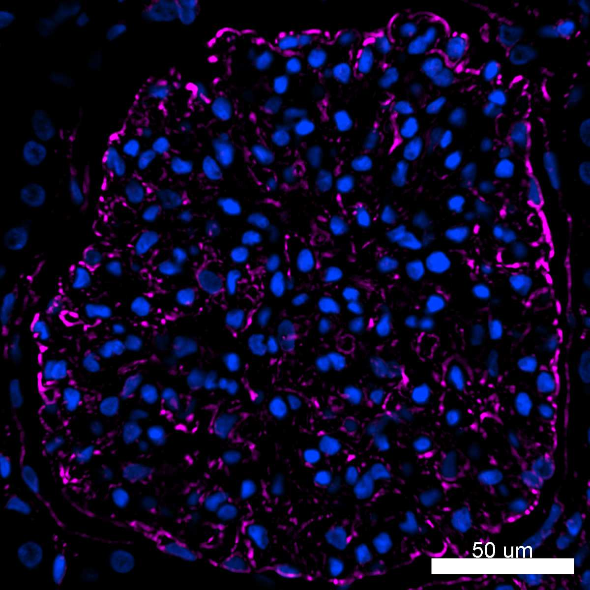
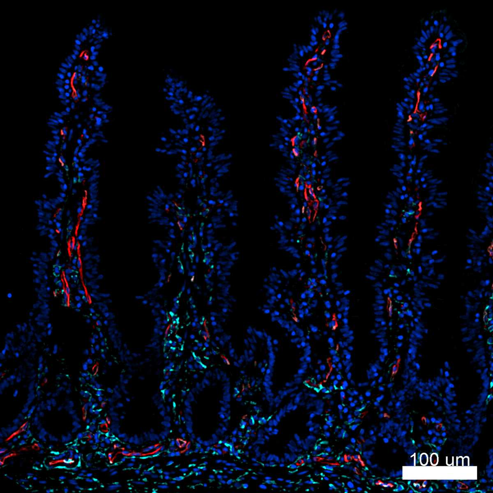
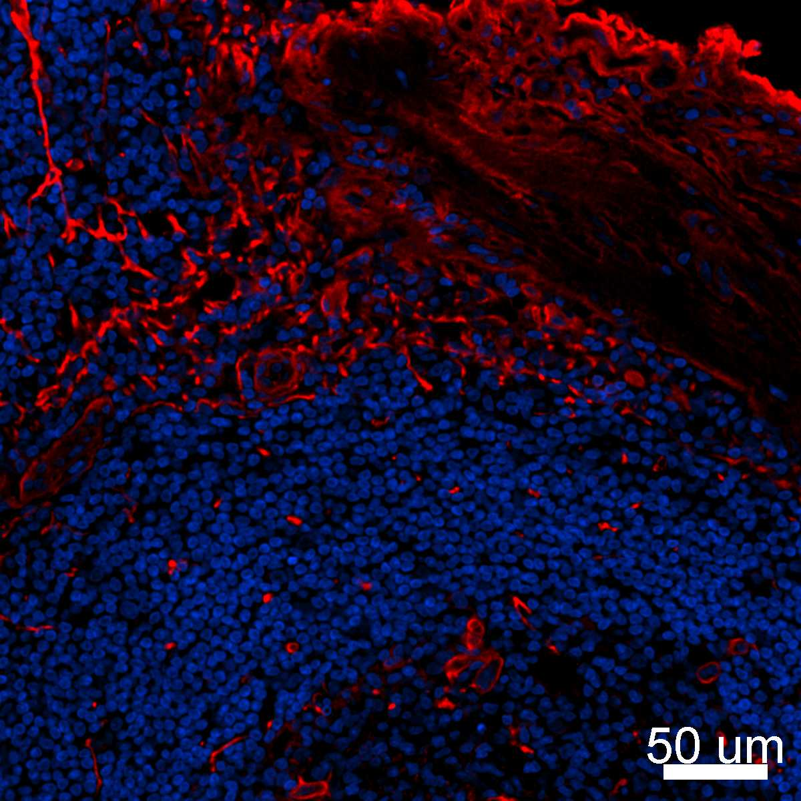

# Configurations

| UniProt Accession Number   | Reagent Type               | Target Name / Protein Biomarker   | Target Species   | Host Organism   | Isotype   | Clonality   | Vendor                   | Catalog Number   | Conjugate   | RRID   | Availability   | Method                 | Tissue Preservation               | Target Tissue   | Tissue State   | Detergent         | Antigen Retrieval Conditions                                                               | Dye Inactivation Conditions   | Recommend   | Agree                                                        | Disagree   | Contributor         | Notes       |
|:---------------------------|:---------------------------|:----------------------------------|:-----------------|:----------------|:----------|:------------|:-------------------------|:-----------------|:------------|:-------|:---------------|:-----------------------|:----------------------------------|:----------------|:---------------|:------------------|:-------------------------------------------------------------------------------------------|:------------------------------|:------------|:-------------------------------------------------------------|:-----------|:--------------------|:------------|
| NA                         | Nuclear Dye                | Hoechst 33342                                | Human            | NA              | NA        | NA          | Biotium                  | 40046            | NA          | NA     | Stock          | IBEX2D Automated       | 1:4 Cytofix/Cytoperm Fixed Frozen | Jejunum         | NA             | 0.3% Triton-X-100 | NA                                                                                         | NA                            | Yes         | [0000-0003-4379-8967](https://orcid.org/0000-0003-4379-8967) [[1](#publications)]                     | NA         | [0000-0003-4379-8967](https://orcid.org/0000-0003-4379-8967) | [1](#notes) |
| NA                         | Nuclear Dye                | Hoechst 33342                                | Human            | NA              | NA        | NA          | Biotium                  | 40046            | NA          | NA     | Stock          | IBEX2D Automated       | 1:4 Cytofix/Cytoperm Fixed Frozen | Lymph Node      | NA             | 0.3% Triton-X-100 | NA                                                                                         | NA                            | Yes         | [0000-0003-4379-8967](https://orcid.org/0000-0003-4379-8967) [[1](#publications)]                     | NA         | [0000-0003-4379-8967](https://orcid.org/0000-0003-4379-8967) | [1](#notes) |
| NA                         | Nuclear Dye                | Hoechst 33342                                | Human            | NA              | NA        | NA          | Biotium                  | 40046            | NA          | NA     | Stock          | IBEX2D Automated       | FFPE                              | Kidney          | NA             | 0.3% Triton-X-100 | pH 6 for 40 minutes at 95C (AR6 Akoya Biosciences AR600250ML)                              | NA                            | Yes         | [0000-0003-4379-8967](https://orcid.org/0000-0003-4379-8967) [[1](#publications)]                     | NA         | [0000-0003-4379-8967](https://orcid.org/0000-0003-4379-8967) | [1](#notes) |
| NA                         | Nuclear Dye                | Hoechst 33342                               | Human            | NA              | NA        | NA          | Biotium                  | 40046            | NA          | NA     | Stock          | IBEX2D Manual          | 1:4 Cytofix/Cytoperm Fixed Frozen | Spleen          | NA             | 0.3% Triton-X-100 | NA                                                                                         | NA                            | Yes         | [0000-0003-4379-8967](https://orcid.org/0000-0003-4379-8967) [[1](#publications), [2](#publications)] | NA         | [0000-0003-4379-8967](https://orcid.org/0000-0003-4379-8967) | [1](#notes) |
| NA                         | Nuclear Dye                | Hoechst 33342                                | Human            | NA              | NA        | NA          | Biotium                  | 40046            | NA          | NA     | Stock          | IBEX2D Manual          | 1:4 Cytofix/Cytoperm Fixed Frozen | Lymph Node      | NA             | 0.3% Triton-X-100 | NA                                                                                         | NA                            | Yes         | [0000-0003-4379-8967](https://orcid.org/0000-0003-4379-8967) [[1](#publications), [2](#publications)] | NA         | [0000-0003-4379-8967](https://orcid.org/0000-0003-4379-8967) | [1](#notes) |

# Publications

1. A. J. Radtke et al., "IBEX: an iterative immunolabeling and chemical bleaching
 method for high-content imaging of diverse tissues", *Nat. Protoc.*, 17(2):378-401, 2022, [doi: 10.1038/s41596-021-00644-9](https://doi.org/10.1038/s41596-021-00644-9).

    A. J. Radtke et al., "Accompanying dataset for: IBEX: An iterative immunolabeling and chemical bleaching method for high-content imaging of diverse tissues", [doi: 10.5281/zenodo.5244550](https://doi.org/10.5281/zenodo.5244551).

2. A. J. Radtke et al., "IBEX: A versatile multiplex optical imaging approach for deep phenotyping and spatial analysis of cells in complex tissues", *Proc Natl Acad Sci*, 117(52):33455–33465, 2020, [doi:10.1073/pnas.2018488117](https://doi.org/10.1073/pnas.2018488117)

# Additional Notes

1. Does not bleach. Use as a fiducial for image alignment and object-based segmentation.

| Human kidney: Hoechst (blue, catalog number 40046) and Vimentin (magenta, catalog number 677807) |
|:-------:|
|  |

| Human jejunum: Hoechst (blue, catalog number 40046), CD106 (cyan, catalog number 305806), and CD31 (red, catalog number 303106) |
|:-------:|
|  |

| Human lymph node: Hoechst (blue, catalog number 40046) and Collagen IV (red, catalog number ab6586) |
|:-------:|
|  |
