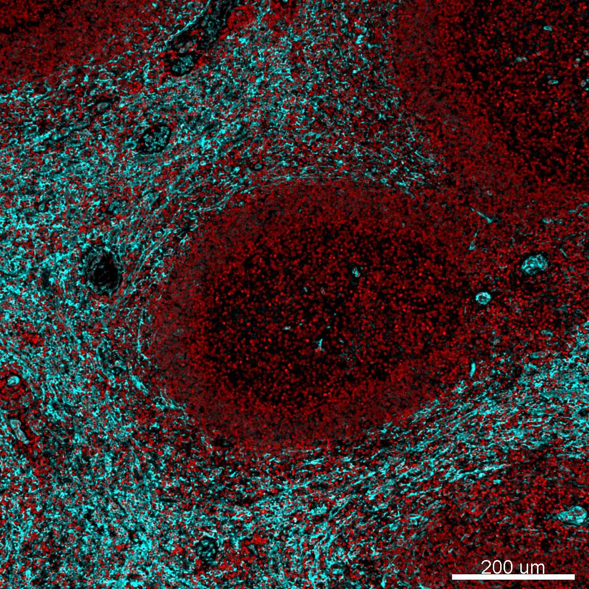

# Configurations

| UniProt Accession Number   | Reagent Type   | Target Name / Protein Biomarker   | Target Species   | Host Organism   | Isotype   | Clonality   | Vendor   |   Catalog Number | Conjugate   | RRID   | Availability   | Method                 | Tissue Preservation   | Target Tissue   | Tissue State   | Detergent         | Antigen Retrieval Conditions                          | Dye Inactivation Conditions   | Recommend   | Agree                                                        | Disagree   | Contributor                                                  | Notes       |
|:---------------------------|:---------------|:----------------------------------|:-----------------|:----------------|:----------|:------------|:---------|-----------------:|:------------|:-------|:---------------|:-----------------------|:----------------------|:----------------|:---------------|:------------------|:------------------------------------------------------|:------------------------------|:------------|:-------------------------------------------------------------|:-----------|:-------------------------------------------------------------|:------------|
| NA                         | Nuclear Dye    | Hoechst 33342                     | Rhesus Macaque   | NA              | NA        | NA          | Biotium  |            40046 | NA          | NA     | Stock          | Multiplexed 2D Imaging | FFPE                  | Spleen          | NA             | 0.3% Triton-X-100 | pH 6 for 20 minutes ER1 (AR9961) using the Leica Bond | NA                            | Yes         | [0009-0004-2746-8743](https://orcid.org/0009-0004-2746-8743) | NA         | [0009-0004-2746-8743](https://orcid.org/0009-0004-2746-8743) | [1](#notes) |

# Publications

# Additional Notes

1. Labels nuclei in tissue sections with great intensity. Used at a 1:5000 dilution.

| NHP spleen: Hoechst (red, catalog number 40046) and CD49a (cyan, catalog number ab243032 and A-31570) |
|:-------:|
|  |
