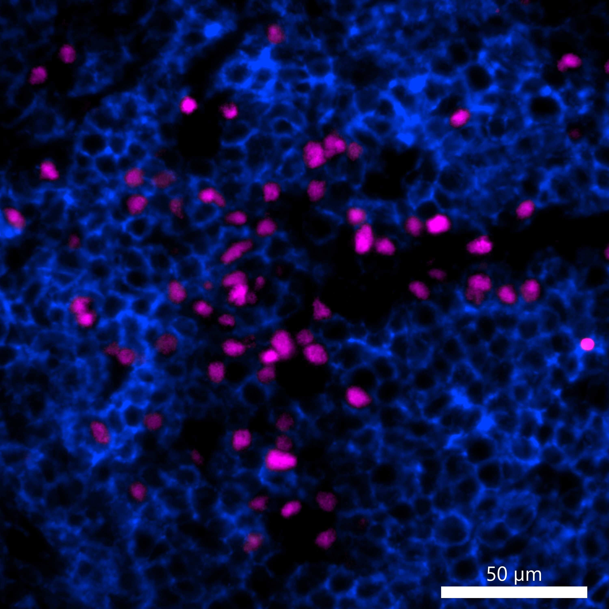

# Configurations

| UniProt Accession Number   | Reagent Type     | Target Name / Protein Biomarker   | Target Species   | Host Organism   | Isotype   | Clonality   | Vendor            | Catalog Number   | Conjugate    | RRID        | Availability   | Method                 | Tissue Preservation   | Target Tissue   | Tissue State   | Detergent         | Antigen Retrieval Conditions                                                               | Dye Inactivation Conditions   | Recommend   | Agree               | Disagree   | Contributor         | Notes       |
|:---------------------------|:-----------------|:----------------------------------|:-----------------|:----------------|:----------|:------------|:------------------|:-----------------|:-------------|:------------|:---------------|:-----------------------|:----------------------|:----------------|:---------------|:------------------|:-------------------------------------------------------------------------------------------|:------------------------------|:------------|:--------------------|:-----------|:--------------------|:------------|
| Q15306                     | Primary Antibody | IRF4                              | Human            | Rabbit          | IgG       | Polyclonal  | Novus Biologicals | NBP1-82814       | Unconjugated | AB_11038596 | Stock          | Multiplexed 2D Imaging | FFPE                  | Tonsil          | NA             | 0.3% Triton-X-100 | pH 6 for 40 minutes at 95C (AR6 Akoya Biosciences AR600250ML)                              | NA                            | Yes         | [0000-0003-4379-8967](https://orcid.org/0000-0003-4379-8967) | NA         | [0000-0003-4379-8967](https://orcid.org/0000-0003-4379-8967) | [1](#notes) |
| Q15306                     | Primary Antibody | IRF4                              | Human            | Mouse           | IgG1      | 4G10        | Novus Biologicals | NBP1-47396       | Unconjugated | AB_10010349 | Stock          | Multiplexed 2D Imaging | FFPE                  | Tonsil          | NA             | 0.3% Triton-X-100 | pH 6 for 40 minutes at 95C (AR6 Akoya Biosciences AR600250ML)                              | NA                            | No          | [0000-0003-4379-8967](https://orcid.org/0000-0003-4379-8967) | NA         | [0000-0003-4379-8967](https://orcid.org/0000-0003-4379-8967) | [2](#notes) |
| Q15306                     | Primary Antibody | IRF4                              | Human            | Mouse           | IgG1      | MUM1p       | Novus Biologicals | NB200-356        | Unconjugated | AB_10003502 | Stock          | Multiplexed 2D Imaging | FFPE                  | Tonsil          | NA             | 0.3% Triton-X-100 | pH 6 for 40 minutes at 95C (AR6 Akoya Biosciences AR600250ML)                              | NA                            | Yes         | [0000-0003-4379-8967](https://orcid.org/0000-0003-4379-8967) | NA         | [0000-0003-4379-8967](https://orcid.org/0000-0003-4379-8967) | [3](#notes) |
| Q15306                     | Primary Antibody | IRF4                              | Human            | Sheep           | IgG       | Polyclonal  | R&D Systems       | AF5525           | Unconjugated | NA          | Stock          | Multiplexed 2D Imaging | FFPE                  | Tonsil          | NA             | 0.3% Triton-X-100 | pH 6 for 40 minutes at 95C (AR6 Akoya Biosciences AR600250ML)                              | NA                            | No          | [0000-0003-4379-8967](https://orcid.org/0000-0003-4379-8967) | NA         | [0000-0003-4379-8967](https://orcid.org/0000-0003-4379-8967) | [4](#notes) |
| Q15306                     | Primary Antibody | IRF4                              | Human            | Mouse           | IgG1      | MUM1p       | Novus Biologicals | NB200-356        | Unconjugated | AB_10003502 | Stock          | Cell DIVE-IBEX         | FFPE                  | Tonsil          | NA             | 0.3% Triton-X-100 | pH 6 for 30 minutes ER1 (AR9961) and pH 9 for 30 minutes ER2 (AR9640) using the Leica Bond | NA                            | Yes         | [0000-0003-4379-8967](https://orcid.org/0000-0003-4379-8967) | NA         | [0000-0003-4379-8967](https://orcid.org/0000-0003-4379-8967) | [5](#notes) |
| Q15306                     | Primary Antibody | IRF4                              | Human            | Mouse           | IgG1      | MUM1p       | Novus Biologicals | NB200-356        | Unconjugated | AB_10003502 | Stock          | Cell DIVE-IBEX | FFPE                  | Lymph Node      | Healthy        | 0.3% Triton-X-100 | pH 6 for 30 minutes ER1 (AR9961) and pH 9 for 30 minutes ER2 (AR9640) using the Leica Bond | NA                            | Yes         | [0000-0003-4379-8967](https://orcid.org/0000-0003-4379-8967) [[1](#publications), [2](#publications)] | NA         | [0000-0003-4379-8967](https://orcid.org/0000-0003-4379-8967) | [6](#notes) |

# Publications

1. A. J. Radtke et al., "Multi-omic profiling of follicular lymphoma reveals changes in tissue architecture and enhanced stromal remodeling in high-risk patients", Cancer Cell, 42(3):444-463, 2024, [doi: 10.1016/j.ccell.2024.02.001](https://doi.org/10.1016/j.ccell.2024.02.001).

2. A. J. Radtke, "OMAP-18: Organ Mapping Antibody Panel (OMAP) for Multiplexed Antibody-Based Imaging of Human Lymph Node with Cell DIVE-IBEX", *Human Reference Atlas*, 2024, [doi: 10.48539/HBM356.HGHM.686](https://doi.org/10.48539/HBM356.HGHM.686).

# Additional Notes

1. Evaluated in human tonsil FFPE samples with CD20 (clone L26) and Hoechst (nuclear marker). Antibody labels nuclei of plasma cells and plasmablasts.
2. Evaluated in human tonsil FFPE samples with CD20 (clone L26) and Hoechst (nuclear marker). Antibody does not yield anticipated staining pattern.
3. Evaluated in human tonsil FFPE samples with CD20 (clone L26) and Hoechst (nuclear marker). Antibody labels nuclei of plasma cells and plasmablasts but is dim. Amplification with secondary antibody is needed.
4. Evaluated in human tonsil FFPE samples with CD20 (clone L26) and Hoechst (nuclear marker). High background and dim signal.
5. Evaluated in human tonsil FFPE samples with CD20 (clone L26) and Hoechst (nuclear marker). Antibody labels nuclei of plasma cells and plasmablasts. Dual antigen retrieval with Leica Bond improves signal dramatically.
6. IRF4 (Novus Biologicals NB200-356) is very dim. Use at a 1:10 dilution and amplify with a secondary antibody (Thermo Fisher Scientific A-21121).

| Human normal LN: CD3 (blue, catalog number ab208514) and IRF4 (magenta, catalog number NB200-356 and A-21121) |
|:-------:|
|  |