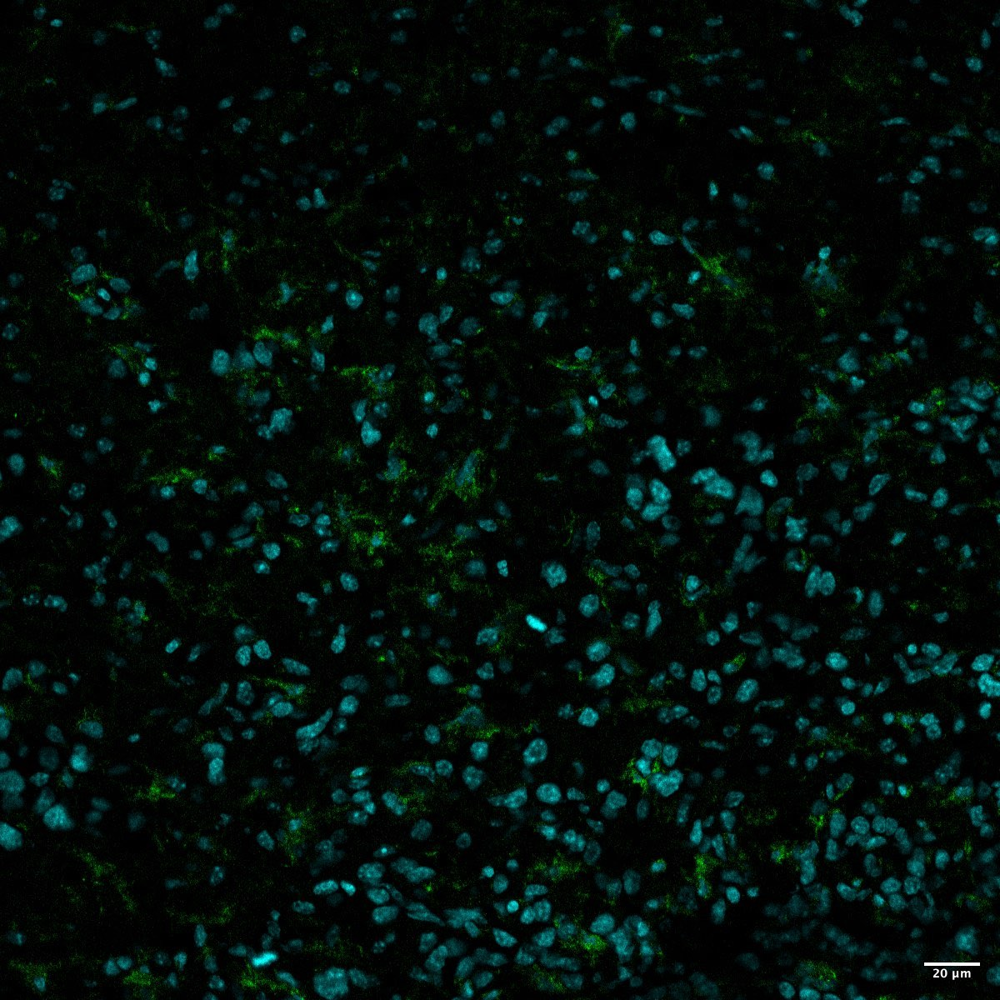

# Configurations

| UniProt Accession Number   | Reagent Type     | Target Name / Protein Biomarker   | Target Species   | Host Organism   | Isotype   | Clonality   | Vendor                  | Catalog Number   | Conjugate   | RRID      | Availability   | Method                 | Tissue Preservation   | Target Tissue   | Tissue State   | Detergent          | Antigen Retrieval Conditions   | Dye Inactivation Conditions   | Recommend   | Agree                                                        | Disagree   | Contributor                                                  | Notes       |
|:---------------------------|:-----------------|:----------------------------------|:-----------------|:----------------|:----------|:------------|:------------------------|:-----------------|:------------|:----------|:---------------|:-----------------------|:----------------------|:----------------|:---------------|:-------------------|:-------------------------------|:------------------------------|:------------|:-------------------------------------------------------------|:-----------|:-------------------------------------------------------------|:------------|
| Q9EQX4                     | Primary Antibody | Iba-1                             | Mouse            | Rabbit          | IgG       | polyclonal  | FUJIFILM Wako Chemicals U.S.A. Corporation | 019-19741        | NA          | AB_839504 | Stock          | Multiplexed 2D Imaging | 4% PFA Fixed Frozen   | Brain           | Tumor          | 0.3% Triton-X-100 | NA                             | NA                            | Yes         | [0000-0002-6944-6997](https://orcid.org/0000-0002-6944-6997) | NA         | [0000-0002-6944-6997](https://orcid.org/0000-0002-6944-6997) | [1](#notes) |

# Publications

# Additional Notes

1. Dilution 1:500.

| Mouse Brain Tumor Hochest (Cyan) Iba (Green_Fuji #019-19741) |
|:-------:|
|  |
