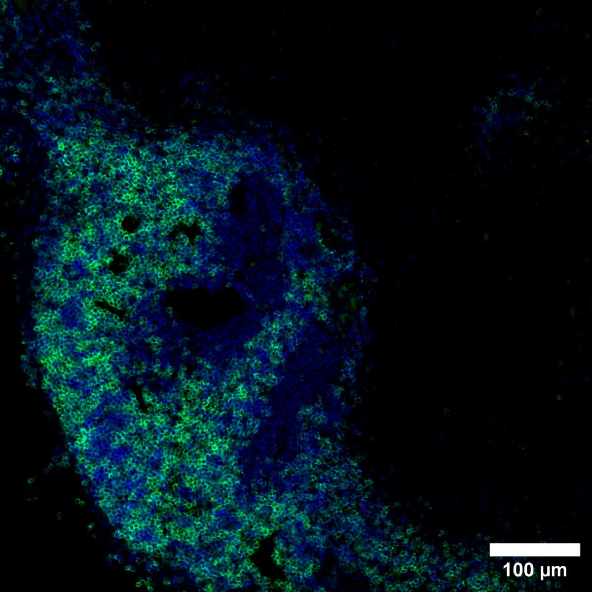

# Configurations

| UniProt Accession Number   | Reagent Type     | Target Name / Protein Biomarker   | Target Species   | Host Organism   | Isotype   | Clonality   | Vendor    |   Catalog Number | Conjugate   | RRID       | Availability   | Method        | Tissue Preservation               | Target Tissue   | Tissue State   | Detergent         | Antigen Retrieval Conditions   | Dye Inactivation Conditions      | Recommend   | Agree                                                        | Disagree   | Contributor                                                  | Notes   |
|:---------------------------|:-----------------|:----------------------------------|:-----------------|:----------------|:----------|:------------|:----------|-----------------:|:------------|:-----------|:---------------|:--------------|:----------------------------------|:----------------|:---------------|:------------------|:-------------------------------|:---------------------------------|:------------|:-------------------------------------------------------------|:-----------|:-------------------------------------------------------------|:--------|
| P01881                     | Primary Antibody | IgD                               | Mouse            | Rat             | IgG2a     | 11-26c.2a   | BioLegend |           405723 | BV510       | AB_2562742 | Stock          | IBEX2D Manual | 1:4 Cytofix/Cytoperm Fixed Frozen | Lymph Node      | NA             | 0.3% Triton-X-100 | NA                             | 1 mg/ml LiBH4 15 minutes + light | Yes         | [0000-0002-1461-0999](https://orcid.org/0000-0002-1461-0999) | NA         | [0000-0002-1461-0999](https://orcid.org/0000-0002-1461-0999) |         |

# Publications

# Additional Notes

| Mouse lymph node: IgD (green, catalog number 405723) and B220 (blue, catalog number 103226) |
|:-------:|
|  |
