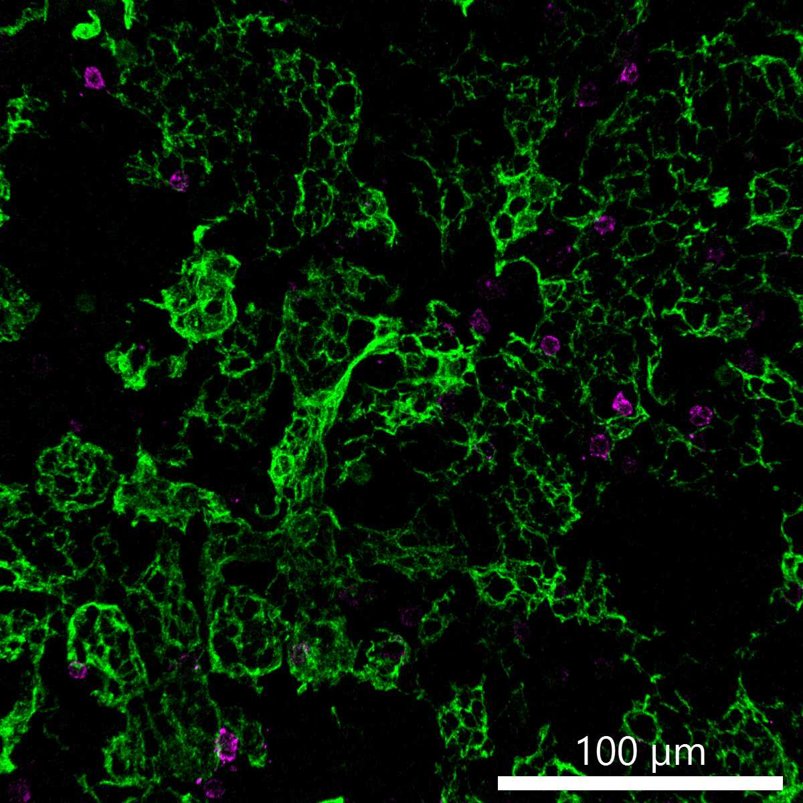

# Configurations

| UniProt Accession Number   | Reagent Type     | Target Name / Protein Biomarker   | Target Species   | Host Organism   | Isotype   | Clonality   | Vendor    | Catalog Number        | Conjugate   | RRID       | Availability   | Method        | Tissue Preservation               | Target Tissue   | Tissue State   | Detergent         | Antigen Retrieval Conditions   | Dye Inactivation Conditions   | Recommend   | Agree                                                        | Disagree   | Contributor                                                  | Notes       |
|:---------------------------|:-----------------|:----------------------------------|:-----------------|:----------------|:----------|:------------|:----------|:----------------------|:------------|:-----------|:---------------|:--------------|:----------------------------------|:----------------|:---------------|:------------------|:-------------------------------|:------------------------------|:------------|:-------------------------------------------------------------|:-----------|:-------------------------------------------------------------|:------------|
| P13647                     | Primary Antibody | Keratin 5                         | Human            | Rabbit          | IgG       | Polyclonal  | BioLegend | 905504 (Unconjugated) | AF532       | AB_3095835 | Custom         | IBEX2D Manual | 1:4 Cytofix/Cytoperm Fixed Frozen | Thymus          | NA             | 0.3% Triton-X-100 | NA                             | 1 mg/ml LiBH4 15 minutes      | Yes         | [0000-0003-4379-8967](https://orcid.org/0000-0003-4379-8967) | NA         | [0000-0003-4379-8967](https://orcid.org/0000-0003-4379-8967) | [1](#notes) |

# Publications

# Additional Notes

1. Referenced in N. Yayon et al., "A spatial human thymus cell atlas mapped to a continuous tissue axis", bioRxiv, 2024, doi: [10.1101/2023.10.25.562925](https://doi.org/10.1101/2023.10.25.562925).

| Human thymus: TCRgammadelta (magenta, catalog number 331210) and Keratin 5 (green, catalog number based on 905504) |
|:-------:|
|  |
