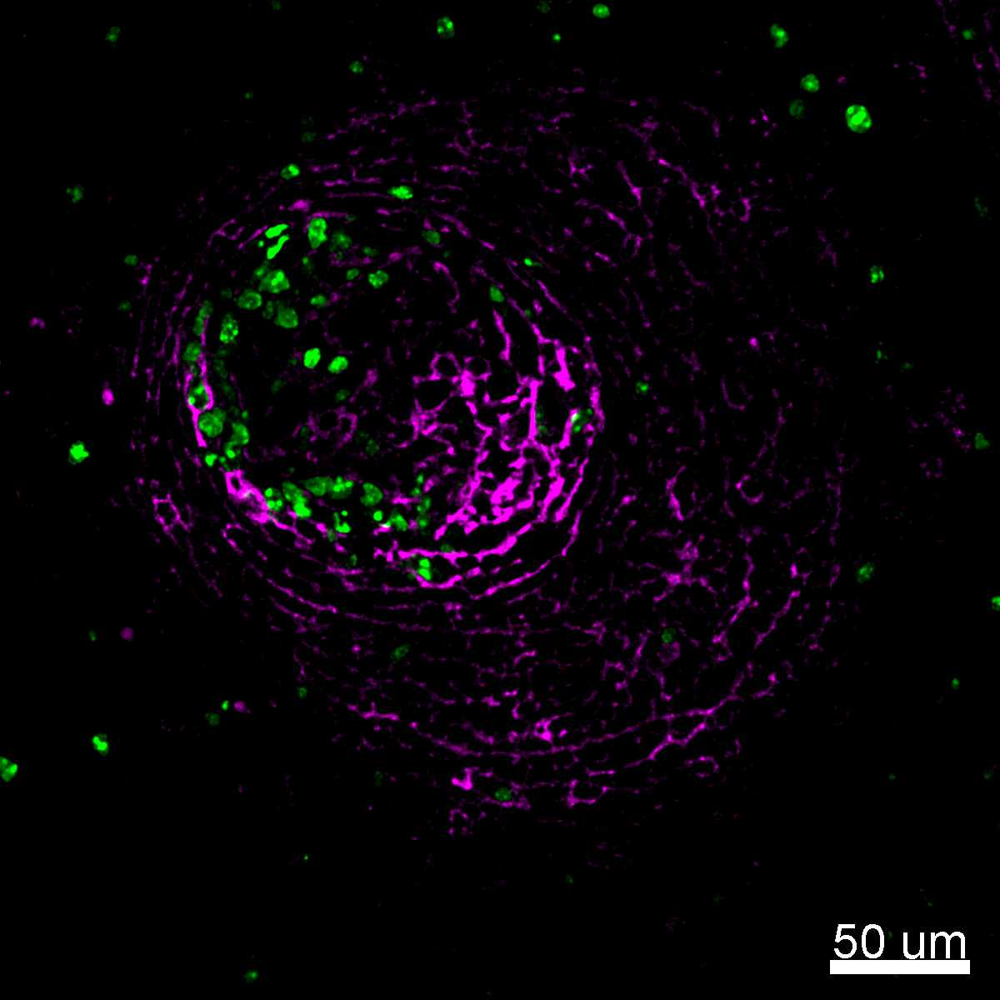
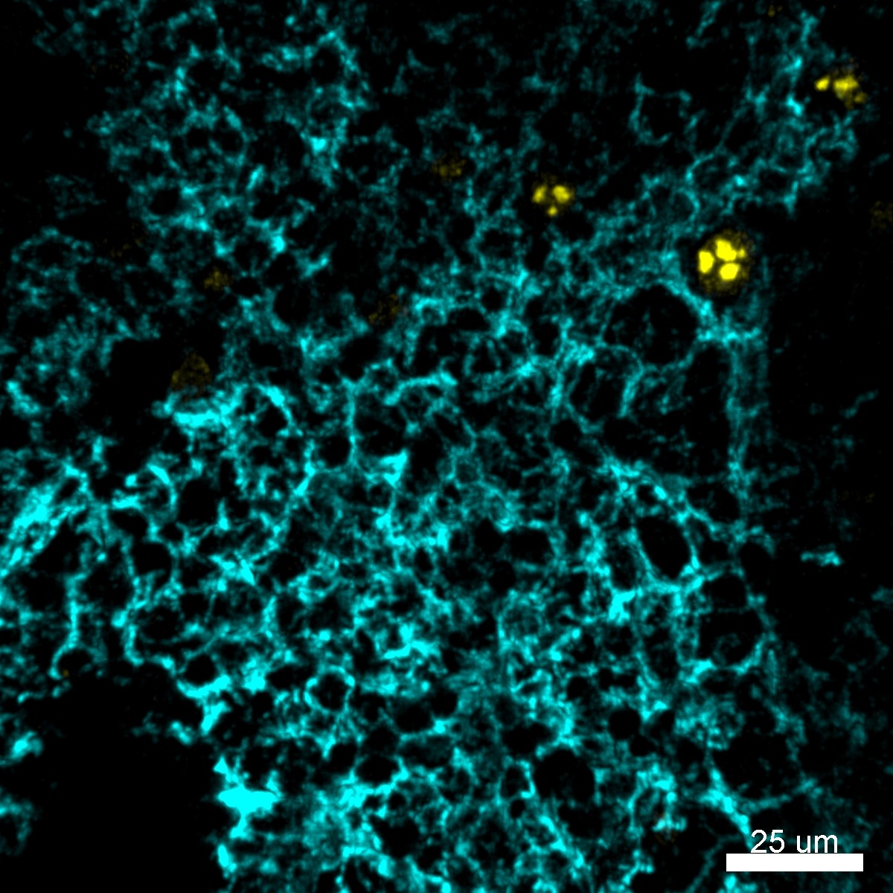

# Configurations

| UniProt Accession Number   | Reagent Type     | Target Name / Protein Biomarker   | Target Species   | Host Organism   | Isotype   | Clonality   | Vendor         |   Catalog Number | Conjugate   | RRID        | Availability   | Method        | Tissue Preservation               | Target Tissue   | Tissue State        | Detergent         | Antigen Retrieval Conditions   | Dye Inactivation Conditions   | Recommend   | Agree                                                        | Disagree   | Contributor         | Notes       |
|:---------------------------|:-----------------|:----------------------------------|:-----------------|:----------------|:----------|:------------|:---------------|-----------------:|:------------|:------------|:---------------|:--------------|:----------------------------------|:----------------|:--------------------|:------------------|:-------------------------------|:------------------------------|:------------|:-------------------------------------------------------------|:-----------|:--------------------|:------------|
| Q9BYG3                     | Primary Antibody | Ki-67                             | Human            | Mouse           | IgG1      | B56         | BD Biosciences |           561277 | AF700       | AB_10611571 | Stock          | IBEX2D Manual | 1:4 Cytofix/Cytoperm Fixed Frozen | Liver           | NA                  | 0.3% Triton-X-100 | NA                             | 1 mg/ml LiBH4 15 minutes      | Yes         | [0000-0003-4379-8967](https://orcid.org/0000-0003-4379-8967) [[3](#publications), [1](#publications)] | NA         | [0000-0003-4379-8967](https://orcid.org/0000-0003-4379-8967) |             |
| Q9BYG3                     | Primary Antibody | Ki-67                             | Human            | Mouse           | IgG1      | B56         | BD Biosciences |           561277 | AF700       | AB_10611571 | Stock          | IBEX2D Manual | 1:4 Cytofix/Cytoperm Fixed Frozen | Lymph Node      | NA                  | 0.3% Triton-X-100 | NA                             | 1 mg/ml LiBH4 15 minutes      | Yes         | [0000-0003-4379-8967](https://orcid.org/0000-0003-4379-8967) [[3](#publications), [1](#publications)] | NA         | [0000-0003-4379-8967](https://orcid.org/0000-0003-4379-8967) |             |
| Q9BYG3                     | Primary Antibody | Ki-67                             | Human            | Mouse           | IgG1      | B56         | BD Biosciences |           561277 | AF700       | AB_10611571 | Stock          | IBEX2D Manual | 1:4 Cytofix/Cytoperm Fixed Frozen | Spleen          | NA                  | 0.3% Triton-X-100 | NA                             | 1 mg/ml LiBH4 15 minutes      | Yes         | [0000-0003-4379-8967](https://orcid.org/0000-0003-4379-8967) [[3](#publications), [1](#publications)] | NA         | [0000-0003-4379-8967](https://orcid.org/0000-0003-4379-8967) |             |
| E9PVX6                     | Primary Antibody | Ki-67                             | Mouse            | Mouse           | IgG1      | B56         | BD Biosciences |           561277 | AF700       | AB_10611571 | Stock          | IBEX2D Manual | 1:4 Cytofix/Cytoperm Fixed Frozen | Spleen          | NA                  | 0.3% Triton-X-100 | NA                             | 1 mg/ml LiBH4 15 minutes      | Yes         | [0000-0003-4379-8967](https://orcid.org/0000-0003-4379-8967) [[3](#publications)]                     | NA         | [0000-0003-4379-8967](https://orcid.org/0000-0003-4379-8967) | [1](#notes) |
| E9PVX7                     | Primary Antibody | Ki-67                             | Mouse            | Mouse           | IgG1      | B56         | BD Biosciences |           561277 | AF700       | AB_10611571 | Stock          | IBEX2D Manual | 1:4 Cytofix/Cytoperm Fixed Frozen | Thymus          | NA                  | 0.3% Triton-X-100 | NA                             | 1 mg/ml LiBH4 15 minutes      | Yes         | [0000-0003-4379-8967](https://orcid.org/0000-0003-4379-8967) [[3](#publications)]                     | NA         | [0000-0003-4379-8967](https://orcid.org/0000-0003-4379-8967) |             |
| E9PVX8                     | Primary Antibody | Ki-67                             | Mouse            | Mouse           | IgG1      | B56         | BD Biosciences |           561277 | AF700       | AB_10611571 | Stock          | IBEX2D Manual | 1:4 Cytofix/Cytoperm Fixed Frozen | Small Intestine | NA                  | 0.3% Triton-X-100 | NA                             | 1 mg/ml LiBH4 15 minutes      | Yes         | [0000-0003-4379-8967](https://orcid.org/0000-0003-4379-8967) [[3](#publications)]                     | NA         | [0000-0003-4379-8967](https://orcid.org/0000-0003-4379-8967) | [1](#notes) |
| E9PVX9                     | Primary Antibody | Ki-67                             | Mouse            | Mouse           | IgG1      | B56         | BD Biosciences |           561277 | AF700       | AB_10611571 | Stock          | IBEX2D Manual | 1:4 Cytofix/Cytoperm Fixed Frozen | Lymph Node      | NA                  | 0.3% Triton-X-100 | NA                             | 1 mg/ml LiBH4 15 minutes      | Yes         | [0000-0003-4379-8967](https://orcid.org/0000-0003-4379-8967) [[3](#publications)]; [0000-0003-1118-7432](https://orcid.org/0000-0003-1118-7432)                     | NA         | [0000-0003-4379-8967](https://orcid.org/0000-0003-4379-8967) |             |
| Q9BYG3                     | Primary Antibody | Ki-67                             | Human            | Mouse           | IgG1      | B56         | BD Biosciences |           561277 | AF700       | AB_10611571 | Stock          | IBEX2D Manual | 1:4 Cytofix/Cytoperm Fixed Frozen | Lymph Node      | Follicular Lymphoma | 0.3% Triton-X-100 | NA                             | 1 mg/ml LiBH4 15 minutes      | Yes         | [0000-0003-4379-8967](https://orcid.org/0000-0003-4379-8967) [[2](#publications)]                     | NA         | [0000-0003-4379-8967](https://orcid.org/0000-0003-4379-8967) |             |

# Publications

1. A. J. Radtke et al., "IBEX: an iterative immunolabeling and chemical bleaching
 method for high-content imaging of diverse tissues", *Nat. Protoc.*, 17(2):378-401, 2022, [doi: 10.1038/s41596-021-00644-9](https://doi.org/10.1038/s41596-021-00644-9).

    A. J. Radtke et al., "Accompanying dataset for: IBEX: An iterative immunolabeling and chemical bleaching method for high-content imaging of diverse tissues", [doi: 10.5281/zenodo.5244550](https://doi.org/10.5281/zenodo.5244551).

2. A. J. Radtke et al., "A Multi-scale, Multiomic Atlas of Human Normal and Follicular Lymphoma Lymph Nodes", *bioRxiv*, 2022, [doi: 10.1101/2022.06.03.494716](https://doi.org/10.1101/2022.06.03.494716).

3. A. J. Radtke et al., "IBEX: A versatile multiplex optical imaging approach for deep phenotyping and spatial analysis of cells in complex tissues", *Proc Natl Acad Sci*, 117(52):33455–33465, 2020, [doi:10.1073/pnas.2018488117](https://doi.org/10.1073/pnas.2018488117)

# Additional Notes

1. Validated by Evelyn Kandov (No ORCID)

| Human lymph node: CD23 (magenta, based on catalog number 338502) and Ki-67 (green, catalog number 561277) |
|:-------:|
|  |

| Human spleen: Ki-67 (yellow, catalog number 561277) and CD21 (cyan, based on catalog number 354902) |
|:-------:|
|  |
