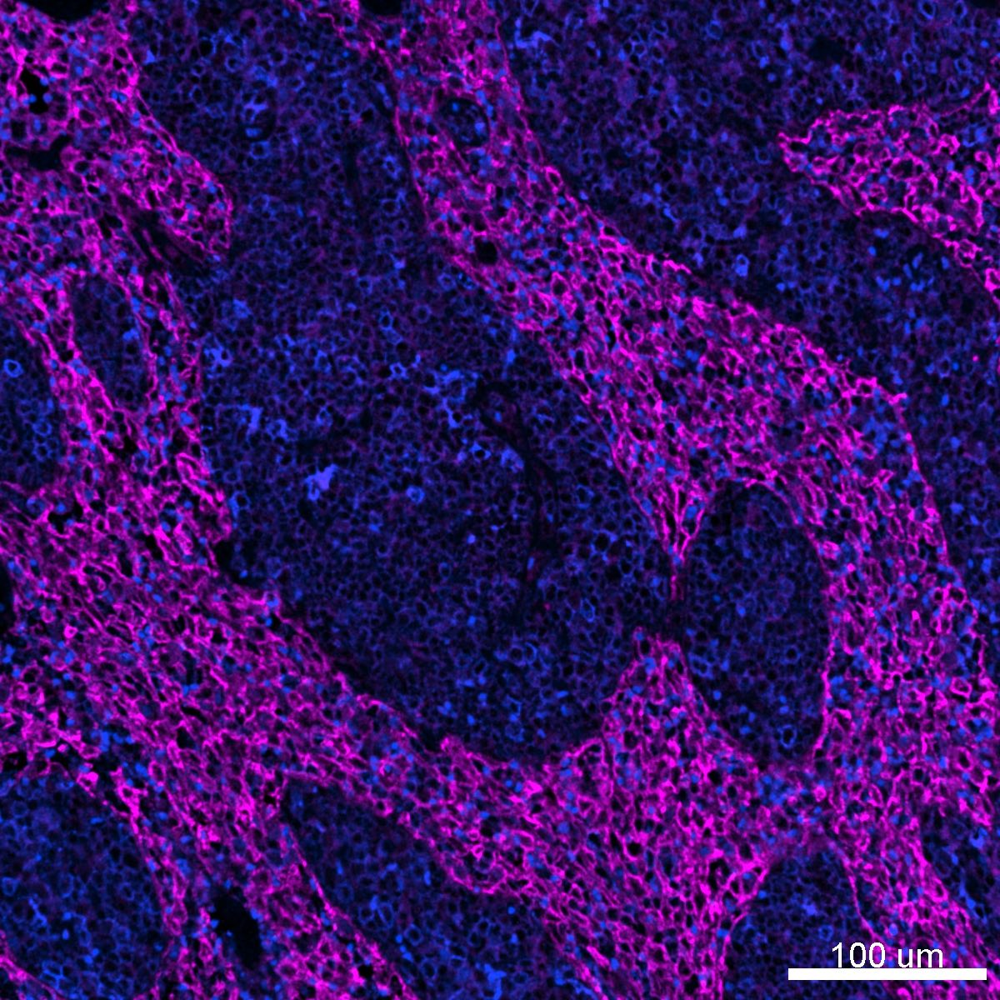

# Configurations

| UniProt Accession Number   | Reagent Type     | Target Name / Protein Biomarker   | Target Species   | Host Organism   | Isotype   | Clonality   | Vendor      | Catalog Number   | Conjugate    | RRID      | Availability   | Method                 | Tissue Preservation   | Target Tissue   | Tissue State   | Detergent         | Antigen Retrieval Conditions                                                               | Dye Inactivation Conditions   | Recommend   | Agree                                                        | Disagree   | Contributor                                                  | Notes       |
|:---------------------------|:-----------------|:----------------------------------|:-----------------|:----------------|:----------|:------------|:------------|:-----------------|:-------------|:----------|:---------------|:-----------------------|:----------------------|:----------------|:---------------|:------------------|:-------------------------------------------------------------------------------------------|:------------------------------|:------------|:-------------------------------------------------------------|:-----------|:-------------------------------------------------------------|:------------|
| A0A8P0NA08                 | Primary Antibody | LYVE-1                            | Canine           | Goat            | IgG       | Polyclonal  | R&D Systems | AF2089           | Unconjugated | AB_355144 | Stock          | Multiplexed 2D Imaging | FFPE                  | Lymph Node      | NA             | 0.3% Triton-X-100 | pH 6 for 30 minutes ER1 (AR9961) and pH 9 for 30 minutes ER2 (AR9640) using the Leica Bond | NA                            | Yes         | [0000-0001-5088-7808](https://orcid.org/0000-0001-5088-7808) | NA         | [0000-0001-5088-7808](https://orcid.org/0000-0001-5088-7808) | [1](#notes) |

# Publications

# Additional Notes

1. Detected using a donkey anti-goat IgG AF647 secondary (A-21447).

| Canine lymph node FFPE: LYVE1 (magenta, catalog number AF2089 and A21203) and HLA-DR (blue, catalog number ab176408) |
|:-------:|
|  |
