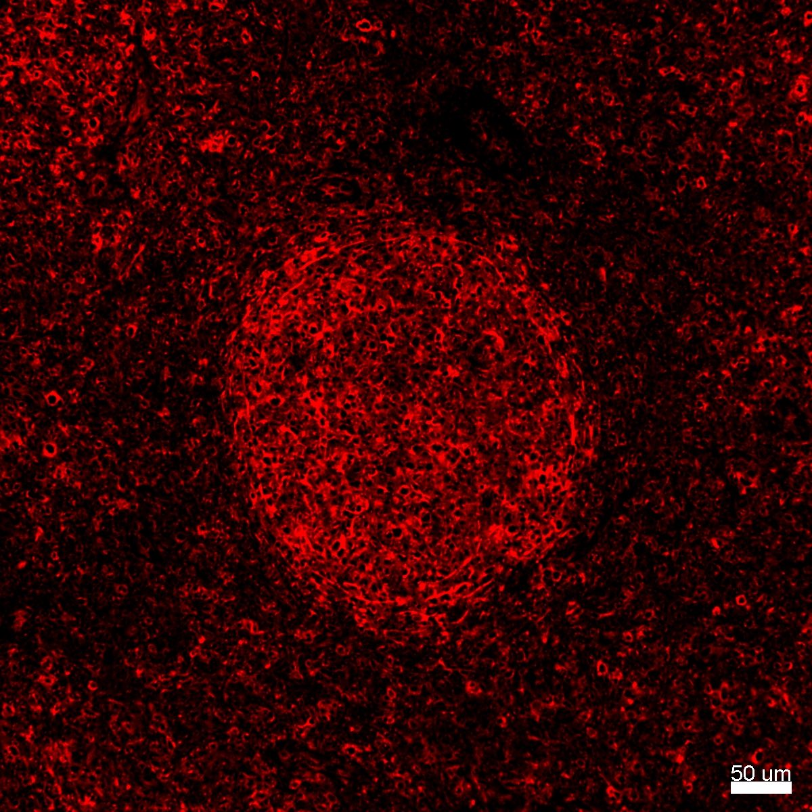
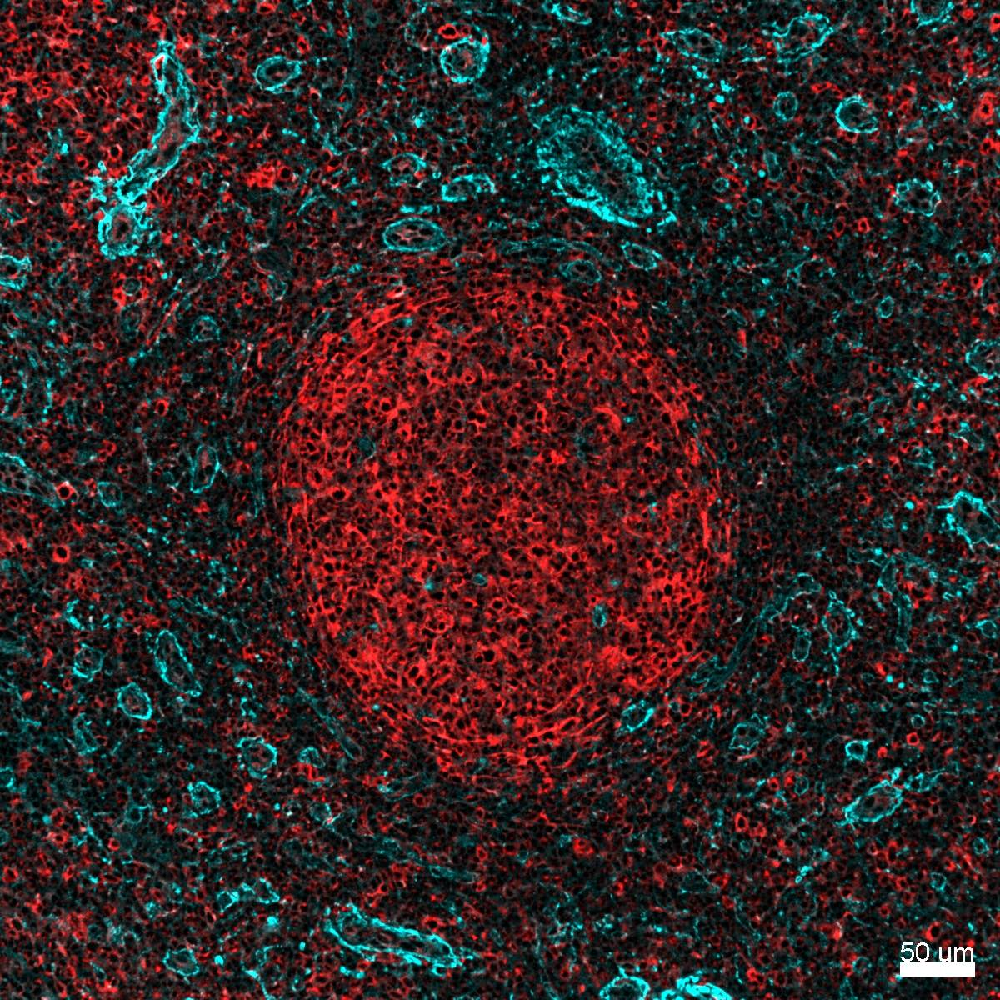

# Configurations

| UniProt Accession Number   | Reagent Type     | Target Name / Protein Biomarker   | Target Species   | Host Organism   | Isotype   | Clonality   | Vendor   | Catalog Number   | Conjugate   | RRID   | Availability   | Method                 | Tissue Preservation   | Target Tissue   | Tissue State        | Detergent         | Antigen Retrieval Conditions                                                               | Dye Inactivation Conditions   | Recommend   | Agree               | Disagree   | Contributor         | Notes       |
|:---------------------------|:-----------------|:----------------------------------|:-----------------|:----------------|:----------|:------------|:---------|:-----------------|:------------|:-------|:---------------|:-----------------------|:----------------------|:----------------|:--------------------|:------------------|:-------------------------------------------------------------------------------------------|:------------------------------|:------------|:--------------------|:-----------|:--------------------|:------------|
| P51884                     | Primary Antibody | Lumican                           | Human            | Rabbit          | IgG       | EPR8898(2)  | Abcam    | Ab252012         | PE          | NA     | Stock          | Multiplexed 2D Imaging | FFPE                  | Lymph Node      | Follicular Lymphoma | 0.3% Triton-X-100 | pH 6 for 30 minutes ER1 (AF9961) and pH 9 for 30 minutes ER2 (AF9640) using the Leica Bond | NA                            | No          | [0000-0003-4379-8967](https://orcid.org/0000-0003-4379-8967) | NA         | [0000-0003-4379-8967](https://orcid.org/0000-0003-4379-8967) | [1](#notes) |

# Publications

# Additional Notes

1. Beautiful staining pattern observed; however, antibody appears to label B cells in the follicle (concentrated circle in center of image) and mesenchymal cells (based on appearance and location) outside of the follicle. Included image depicts lumican antibody (red) in follicular lymphoma FFPE sample prepared with dual antigen retrieval (pH 6 and 9). This antibody yields a distinct staining pattern compared to a well characterized polyclonal antibody (Lumican R&D Systems AF2846: cyan in second image). Similar results, a follicular staining pattern, were observed in human FFPE tonsil samples.
 
 