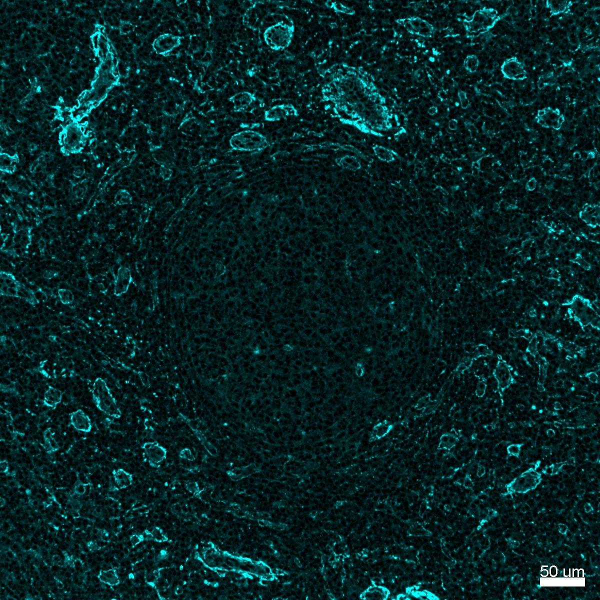

# Configurations

| UniProt Accession Number   | Reagent Type     | Target Name / Protein Biomarker   | Target Species   | Host Organism   | Isotype   | Clonality   | Vendor      | Catalog Number   | Conjugate    | RRID       | Availability   | Method                 | Tissue Preservation   | Target Tissue   | Tissue State        | Detergent         | Antigen Retrieval Conditions                                                               | Dye Inactivation Conditions   | Recommend   | Agree                                    | Disagree   | Contributor         | Notes       |
|:---------------------------|:-----------------|:----------------------------------|:-----------------|:----------------|:----------|:------------|:------------|:-----------------|:-------------|:-----------|:---------------|:-----------------------|:----------------------|:----------------|:--------------------|:------------------|:-------------------------------------------------------------------------------------------|:------------------------------|:------------|:-----------------------------------------|:-----------|:--------------------|:------------|
| P51884                     | Primary Antibody | Lumican                           | Human            | Goat            | IgG       | Polyclonal  | R&D Systems | AF2846           | Unconjugated | AB_2139484 | Stock          | Multiplexed 2D Imaging | FFPE                  | Lymph Node      | Follicular Lymphoma | 0.3% Triton-X-100 | pH 6 for 40 minutes at 95C (AR6 Akoya Biosciences AR600250ML)                              | NA                            | Yes         | 0000-0003-4379-8967 [[1](#publications)] | NA         | 0000-0003-4379-8967 |             |
| P51884                     | Primary Antibody | Lumican                           | Human            | Goat            | IgG       | Polyclonal  | R&D Systems | AF2846           | Unconjugated | AB_2139484 | Stock          | Cell DIVE-IBEX         | FFPE                  | Tonsil          | NA                  | 0.3% Triton-X-100 | pH 6 for 30 minutes ER1 (AF9961) and pH 9 for 30 minutes ER2 (AF9640) using the Leica Bond | NA                            | Yes         | 0000-0003-4379-8967                      | NA         | 0000-0003-4379-8967 | [1](#notes) |
| P51884                     | Primary Antibody | Lumican                           | Human            | Goat            | IgG       | Polyclonal  | R&D Systems | AF2846           | Unconjugated | AB_2139484 | Stock          | Multiplexed 2D Imaging | FFPE                  | Lymph Node      | Follicular Lymphoma | 0.3% Triton-X-100 | pH 6 for 30 minutes ER1 (AF9961) and pH 9 for 30 minutes ER2 (AF9640) using the Leica Bond | NA                            | Yes         | 0000-0003-4379-8967                      | NA         | 0000-0003-4379-8967 | [2](#notes) |

# Publications

1. A. J. Radtke et al., "A Multi-scale, Multiomic Atlas of Human Normal and Follicular Lymphoma Lymph Nodes", *bioRxiv*, 2022, [doi: 10.1101/2022.06.03.494716](https://doi.org/10.1101/2022.06.03.494716).

# Additional Notes

1. Antibody labels ECM of tonsil and works great with the Cell DIVE imager.
2. Antibody labels extracellular matrix in a wide variety of tissues. Signal is amplified with a donkey anti-goat AF680 antibody (Thermo Fisher Scientific A-21084). Included image depicts lumican (cyan) antibody in follicular lymphoma FFPE sample prepared with dual antigen retrieval (pH 6 and 9). Antibody labels matrix proteins around vessels and outlines reticular network as expected.
