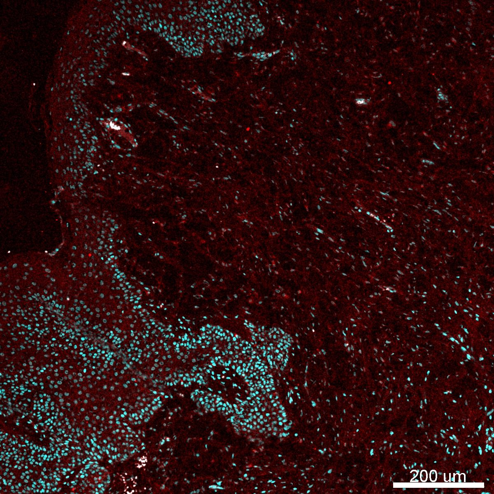

# Configurations

| UniProt Accession Number   | Reagent Type     | Target Name / Protein Biomarker   | Target Species   | Host Organism   | Isotype   | Clonality   | Vendor                   | Catalog Number   | Conjugate    | RRID   | Availability   | Method                 | Tissue Preservation   | Target Tissue   | Tissue State   | Detergent         | Antigen Retrieval Conditions                                                               | Dye Inactivation Conditions   | Recommend   | Agree                                                        | Disagree   | Contributor                                                  | Notes       |
|:---------------------------|:-----------------|:----------------------------------|:-----------------|:----------------|:----------|:------------|:-------------------------|:-----------------|:-------------|:-------|:---------------|:-----------------------|:----------------------|:----------------|:---------------|:------------------|:-------------------------------------------------------------------------------------------|:------------------------------|:------------|:-------------------------------------------------------------|:-----------|:-------------------------------------------------------------|:------------|
| A0A8C0S4Q3                 | Primary Antibody | Melan-A                           | Canine           | Mouse           | IgG1      | rMLANA      | Thermo Fisher Scientific | 2315-MSM12-P1    | Unconjugated | NA     | Stock          | Multiplexed 2D Imaging | FFPE                  | Skin            | Melanoma       | 0.3% Triton-X-100 | pH 6 for 30 minutes ER1 (AR9961) and pH 9 for 30 minutes ER2 (AR9640) using the Leica Bond | NA                            | No          | [0000-0001-5088-7808](https://orcid.org/0000-0001-5088-7808) | NA         | [0000-0001-5088-7808](https://orcid.org/0000-0001-5088-7808) | [1](#notes) |

# Publications

# Additional Notes

1. Evaluated in canine melanoma skin samples using a 1:50 dilution and a donkey anti-mouse secondary antibody (Thermo Fisher Scientific, A31570). Antibody does not label tumor cells in the skin. Non-specific, low background labeling observed. Samples may have been overfixed (48 hours to 1 week+ in 10% formalin). Intense antigen retrieval (pH 6 and pH 9) was needed for well established antibodies (pan-cytokeratin, clone AE1/AE3).

| Canine melanoma skin FFPE: Melan-A (red, catalog number 2315-MSM12-P1 and A31570) and Hoechst (cyan, catalog number 40046) |
|:-------:|
|  |
