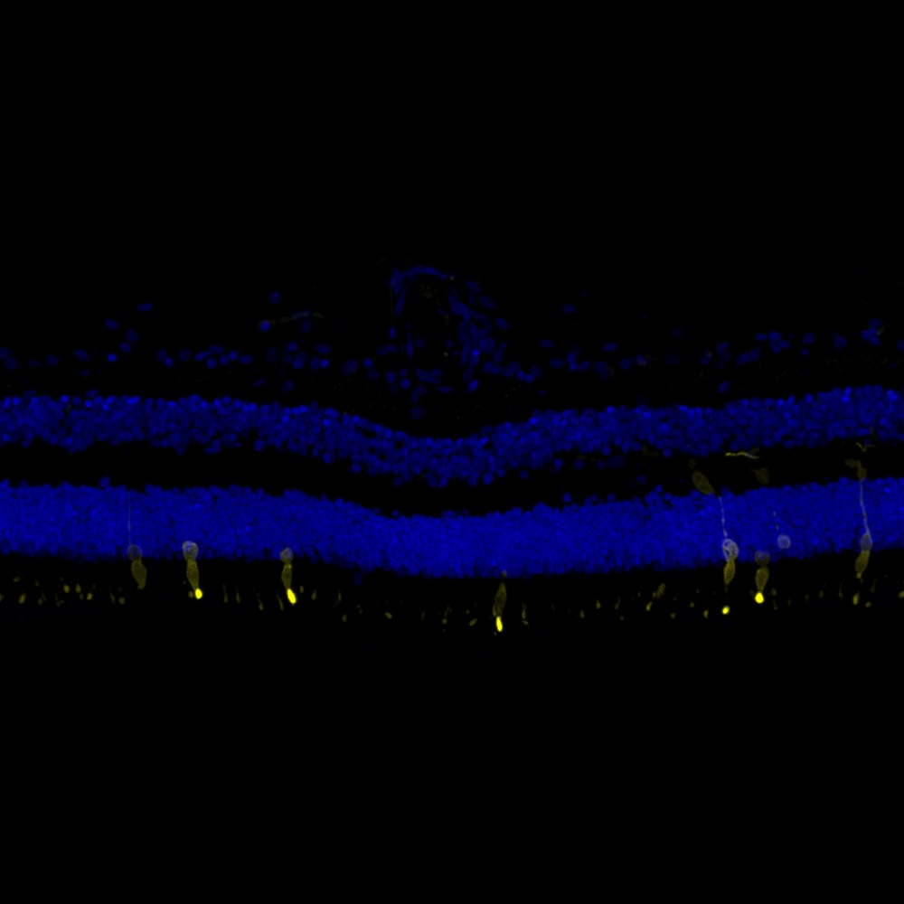

# Configurations

| UniProt Accession Number   | Reagent Type     | Target Name / Protein Biomarker   | Target Species   | Host Organism   | Isotype   | Clonality   | Vendor         | Catalog Number   | Conjugate    | RRID      | Availability   | Method        | Tissue Preservation               | Target Tissue   | Tissue State   | Detergent    | Antigen Retrieval Conditions   | Dye Inactivation Conditions   | Recommend   | Agree               | Disagree   | Contributor         | Notes       |
|:---------------------------|:-----------------|:----------------------------------|:-----------------|:----------------|:----------|:------------|:---------------|:-----------------|:-------------|:----------|:---------------|:--------------|:----------------------------------|:----------------|:---------------|:-------------|:-------------------------------|:------------------------------|:------------|:--------------------|:-----------|:--------------------|:------------|
| P51491                     | Primary Antibody | Opsin Blue                        | Mouse            | Rabbit          | IgG       | Polyclonal  | MilliporeSigma | AB5407           | Unconjugated | AB_177457 | Stock          | IBEX2D Manual | 1:4 Cytofix/Cytoperm Fixed Frozen | Retina          | NA             | 0.1% Saponin | NA                             | NA                            | Yes         | [0000-0003-2088-8310](https://orcid.org/0000-0003-2088-8310) | NA         | [0000-0003-2088-8310](https://orcid.org/0000-0003-2088-8310) | [1](#notes) |
| P03999                     | Primary Antibody | Opsin Blue                        | Human            | Rabbit          | IgG       | Polyclonal  | MilliporeSigma | AB5407           | Unconjugated | AB_177457 | Stock          | IBEX2D Manual | 1:4 Cytofix/Cytoperm Fixed Frozen | Retina          | NA             | 0.1% Saponin | NA                             | NA                            | Yes         | [0000-0003-2088-8310](https://orcid.org/0000-0003-2088-8310) | NA         | [0000-0003-2088-8310](https://orcid.org/0000-0003-2088-8310) | [2](#notes) |

# Publications

# Additional Notes

1. Restricted to S-cone outer segments as expected.
2. Restricted to S-cones as expected.

| Human retina: Opsin Blue (yellow, catalog number AB5407) and Hoechst (blue, catalog number 40046) |
|:-------:|
|  |
