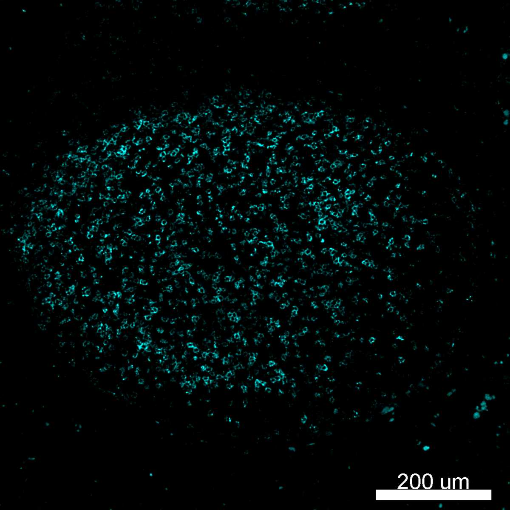
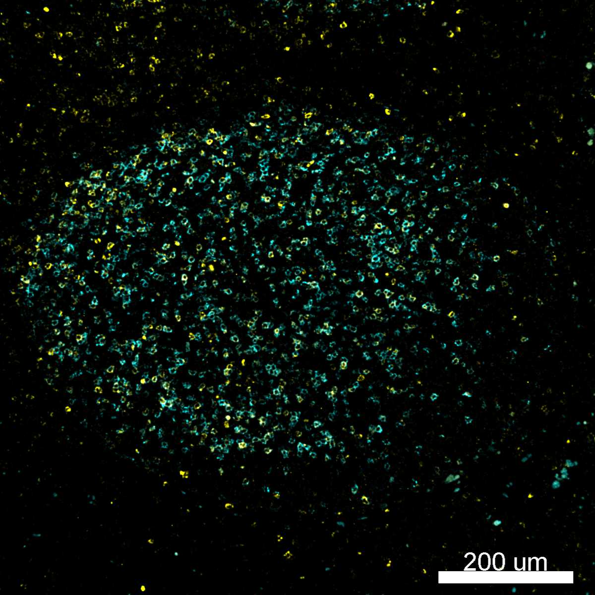

# Configurations

| UniProt Accession Number   | Reagent Type     | Target Name / Protein Biomarker   | Target Species   | Host Organism   | Isotype   | Clonality   | Vendor   | Catalog Number   | Conjugate   | RRID       | Availability   | Method         | Tissue Preservation   | Target Tissue   | Tissue State   | Detergent         | Antigen Retrieval Conditions                                                               | Dye Inactivation Conditions   | Recommend   | Agree               | Disagree   | Contributor         | Notes       |
|:---------------------------|:-----------------|:----------------------------------|:-----------------|:----------------|:----------|:------------|:---------|:-----------------|:------------|:-----------|:---------------|:---------------|:----------------------|:----------------|:---------------|:------------------|:-------------------------------------------------------------------------------------------|:------------------------------|:------------|:--------------------|:-----------|:--------------------|:------------|
| Q15116                     | Primary Antibody | PD-1                              | Human            | Rabbit          | IgG       | EPR4877(2)  | Abcam    | ab275126         | AF555       | AB_2728811 | Stock          | Cell DIVE-IBEX | FFPE                  | Tonsil          | NA             | 0.3% Triton-X-100 | pH 6 for 30 minutes ER1 (AR9961) and pH 9 for 30 minutes ER2 (AR9640) using the Leica Bond | 1 mg/ml LiBH4 15 minutes      | Yes         | [0000-0003-4379-8967](https://orcid.org/0000-0003-4379-8967) | NA         | [0000-0003-4379-8967](https://orcid.org/0000-0003-4379-8967) | [1](#notes) |
| Q15116                     | Primary Antibody | PD-1                              | Human            | Rabbit          | IgG       | EPR4877(2)  | Abcam    | ab275126         | AF555       | AB_2728811 | Stock          | Multiplexed 2D Imaging | FFPE                  | Lymph node      | Follicular Lymphoma | 0.3% Triton-X-100 | pH 6 for 30 minutes ER1 (AR9961) and pH 9 for 30 minutes ER2 (AR9640) using the Leica Bond | NA                            | Yes         | [0000-0003-4379-8967](https://orcid.org/0000-0003-4379-8967) | NA         | [0000-0003-4379-8967](https://orcid.org/0000-0003-4379-8967) |   [2](#notes) |

# Publications

# Additional Notes

1. Labels T follicular helper cells in germinal centers and colocalizes with CD3. Brighter signal with dual antigen retrieval.
2. Antibody labels T follicular helper cells in the germinal centers of human FFPE lymph nodes and tonsils. Use at a high concentration (1:10) for best results.

| Human FFPE follicular lymphoma lymph node: PD-1 (cyan, catalog number ab275126) |
|:-------:|
|  |

| Human FFPE follicular lymphoma lymph node: HLA-DR (red, catalog number NBP2-47670AF488) and PD-1 (cyan, catalog number ab275126) |
|:-------:|
|  |

| Human FFPE follicular lymphoma lymph node: CTLA-4 (yellow, catalog number ab270127 and PD-1 (cyan, catalog number ab275126) |
|:-------:|
|  |
