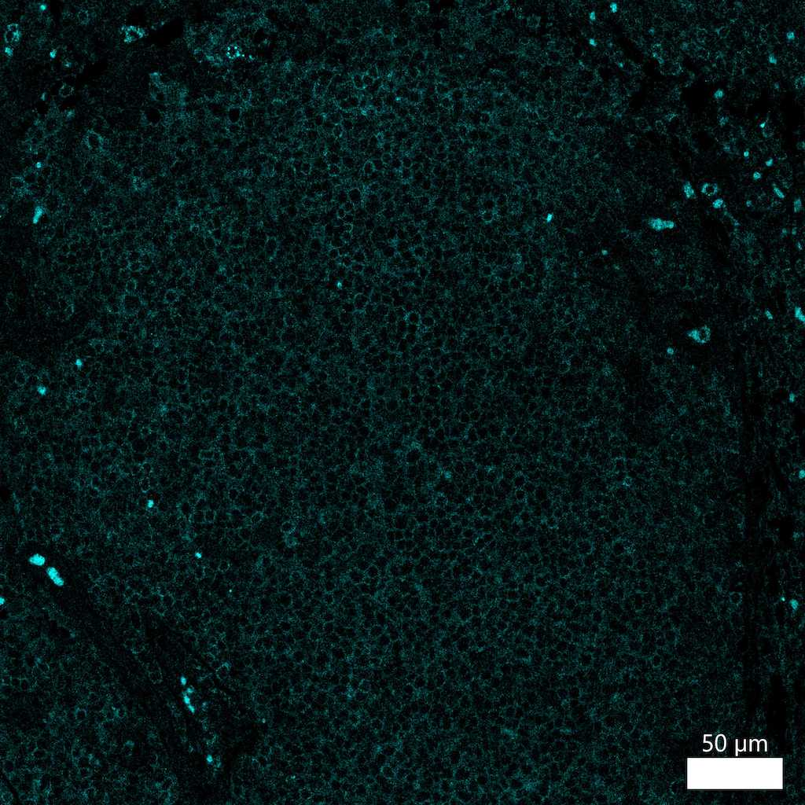

# Configurations

| UniProt Accession Number   | Reagent Type     | Target Name / Protein Biomarker   | Target Species   | Host Organism   | Isotype   | Clonality   | Vendor                    | Catalog Number   | Conjugate    | RRID   | Availability   | Method                 | Tissue Preservation   | Target Tissue   | Tissue State   | Detergent         | Antigen Retrieval Conditions                                                               | Dye Inactivation Conditions   | Recommend   | Agree                                                        | Disagree   | Contributor                                                  | Notes       |
|:---------------------------|:-----------------|:----------------------------------|:-----------------|:----------------|:----------|:------------|:--------------------------|:-----------------|:-------------|:-------|:---------------|:-----------------------|:----------------------|:----------------|:---------------|:------------------|:-------------------------------------------------------------------------------------------|:------------------------------|:------------|:-------------------------------------------------------------|:-----------|:-------------------------------------------------------------|:------------|
| O00329                     | Primary Antibody | PI3 Kinase p110 delta             | Human            | Rabbit          | IgG       | E2T2N       | Cell Signaling Technology | 19591S           | Unconjugated | NA     | Stock          | Multiplexed 2D Imaging | FFPE                  | Tonsil          | NA             | 0.3% Triton-X-100 | pH 6 for 30 minutes ER1 (AR9961) and pH 9 for 30 minutes ER2 (AR9640) using the Leica Bond | NA                            | No          | [0000-0003-4379-8967](https://orcid.org/0000-0003-4379-8967) | NA         | [0000-0003-4379-8967](https://orcid.org/0000-0003-4379-8967) | [1](#notes) |

# Publications

# Additional Notes

1. Antibody labeling is inconclusive and appears to label all cells in the tonsil. Used at a dilution of 1:50 with an anti-rabbit AF594 secondary antibody (Thermo Fisher Scientific catalog number A-21207).

| Human tonsil FFPE : PI3 Kinase p110 (cyan, catalog number 19591) |
|:-------:|
|  |
