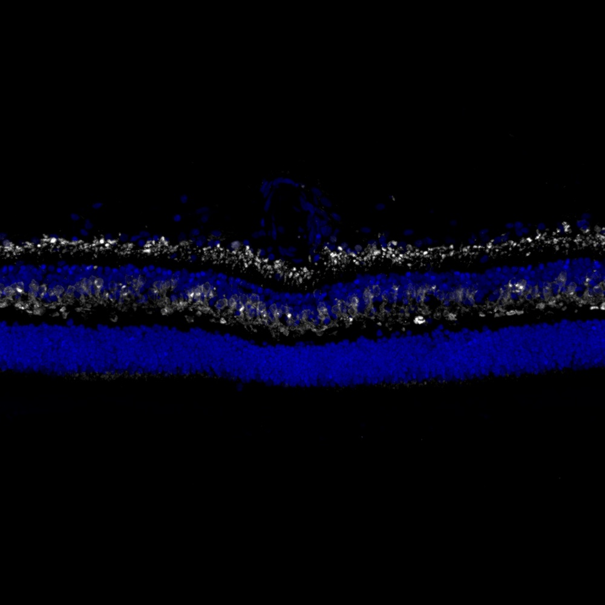

# Configurations

| UniProt Accession Number   | Reagent Type     | Target Name / Protein Biomarker   | Target Species   | Host Organism   | Isotype   | Clonality   | Vendor                   | Catalog Number   | Conjugate   | RRID      | Availability   | Method        | Tissue Preservation               | Target Tissue   | Tissue State   | Detergent    | Antigen Retrieval Conditions   | Dye Inactivation Conditions   | Recommend   | Agree               | Disagree   | Contributor         | Notes       |
|:---------------------------|:-----------------|:----------------------------------|:-----------------|:----------------|:----------|:------------|:-------------------------|:-----------------|:------------|:----------|:---------------|:--------------|:----------------------------------|:----------------|:---------------|:-------------|:-------------------------------|:------------------------------|:------------|:--------------------|:-----------|:--------------------|:------------|
| P20444                     | Primary Antibody | PKC alpha                         | Mouse            | Mouse           | IgG1      | H-7         | Santa Cruz Biotechnology | sc-8393 AF680    | AF680       | AB_628142 | Stock          | IBEX2D Manual | 1:4 Cytofix/Cytoperm Fixed Frozen | Retina          | NA             | 0.1% Saponin | NA                             | 1 mg/ml LiBH4 15 minutes      | Yes         | [0000-0003-2088-8310](https://orcid.org/0000-0003-2088-8310) | NA         | [0000-0003-2088-8310](https://orcid.org/0000-0003-2088-8310) | [1](#notes) |
| P17252                     | Primary Antibody | PKC alpha                         | Human            | Mouse           | IgG1      | H-7         | Santa Cruz Biotechnology | sc-8393 AF680    | AF680       | AB_628142 | Stock          | IBEX2D Manual | 1:4 Cytofix/Cytoperm Fixed Frozen | Retina          | NA             | 0.1% Saponin | NA                             | 1 mg/ml LiBH4 15 minutes      | Yes         | [0000-0003-2088-8310](https://orcid.org/0000-0003-2088-8310) | NA         | [0000-0003-2088-8310](https://orcid.org/0000-0003-2088-8310) | [2](#notes) |

# Publications

# Additional Notes

1. Specific to bipolar cells as expected.
2. Stains bipolar cells in the human retina, core part of visual signalling.

| Human retina: PKC alpha (white, catalog number sc-8393 AF680) and Hoechst (blue, catalog number 40046) |
|:-------:|
|  |
