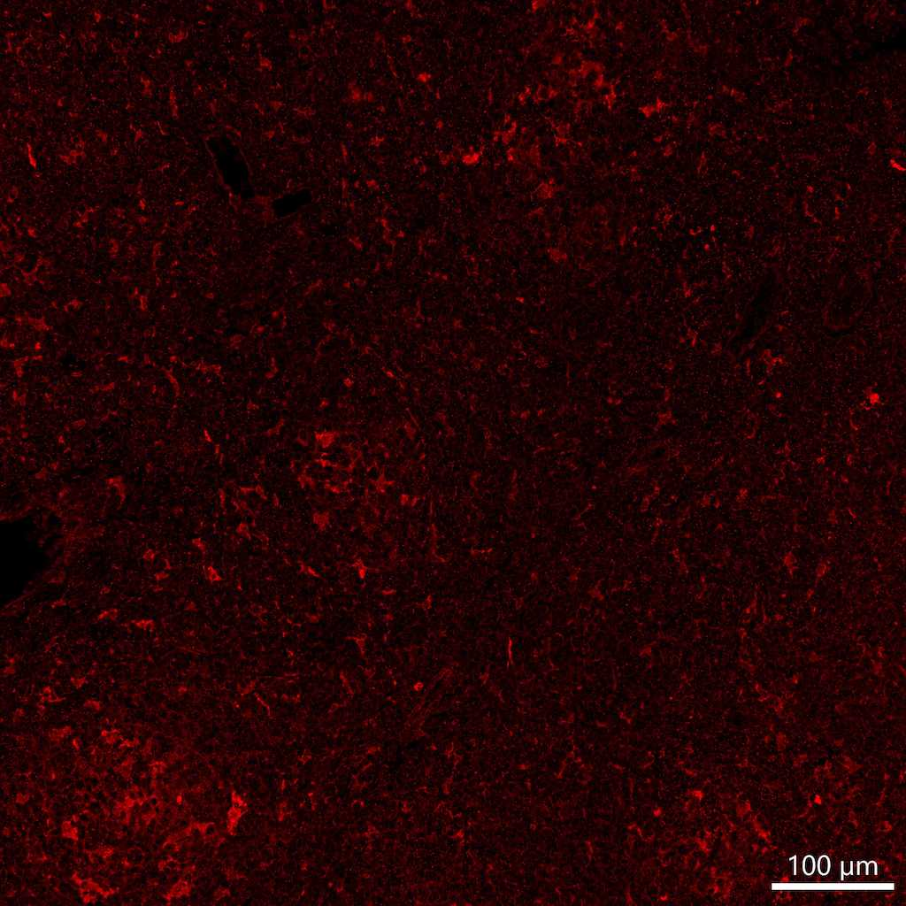

# Configurations

| UniProt Accession Number   | Reagent Type     | Target Name / Protein Biomarker   | Target Species   | Host Organism   | Isotype   | Clonality   | Vendor                    | Catalog Number   | Conjugate    | RRID       | Availability   | Method                 | Tissue Preservation   | Target Tissue   | Tissue State        | Detergent         | Antigen Retrieval Conditions                                                               | Dye Inactivation Conditions   | Recommend   | Agree                                                        | Disagree   | Contributor                                                  | Notes       |
|:---------------------------|:-----------------|:----------------------------------|:-----------------|:----------------|:----------|:------------|:--------------------------|:-----------------|:-------------|:-----------|:---------------|:-----------------------|:----------------------|:----------------|:--------------------|:------------------|:-------------------------------------------------------------------------------------------|:------------------------------|:------------|:-------------------------------------------------------------|:-----------|:-------------------------------------------------------------|:------------|
| P31751                     | Primary Antibody | Phospho-Akt                       | Human            | Rabbit          | IgG       | D9E         | Cell Signaling Technology | 4060T            | Unconjugated | AB_2315049 | Stock          | Multiplexed 2D Imaging | FFPE                  | Lymph Node      | Follicular Lymphoma | 0.3% Triton-X-100 | pH 6 for 30 minutes ER1 (AR9961) and pH 9 for 30 minutes ER2 (AR9640) using the Leica Bond | NA                            | No          | [0000-0003-4379-8967](https://orcid.org/0000-0003-4379-8967) | NA         | [0000-0003-4379-8967](https://orcid.org/0000-0003-4379-8967) | [1](#notes) |

# Publications

# Additional Notes

1. Inconclusive antibody labeling. Appears to label cytoplasm of stromal cells but unclear. Evaluated at a dilution of 1:50 with an anti-rabbit secondary antibody (Thermo Fisher Scientific catalog number A-21207).

| Human follicular lymphoma FFPE : Phospho-Akt (red, catalog number 4060T) |
|:-------:|
|  |
