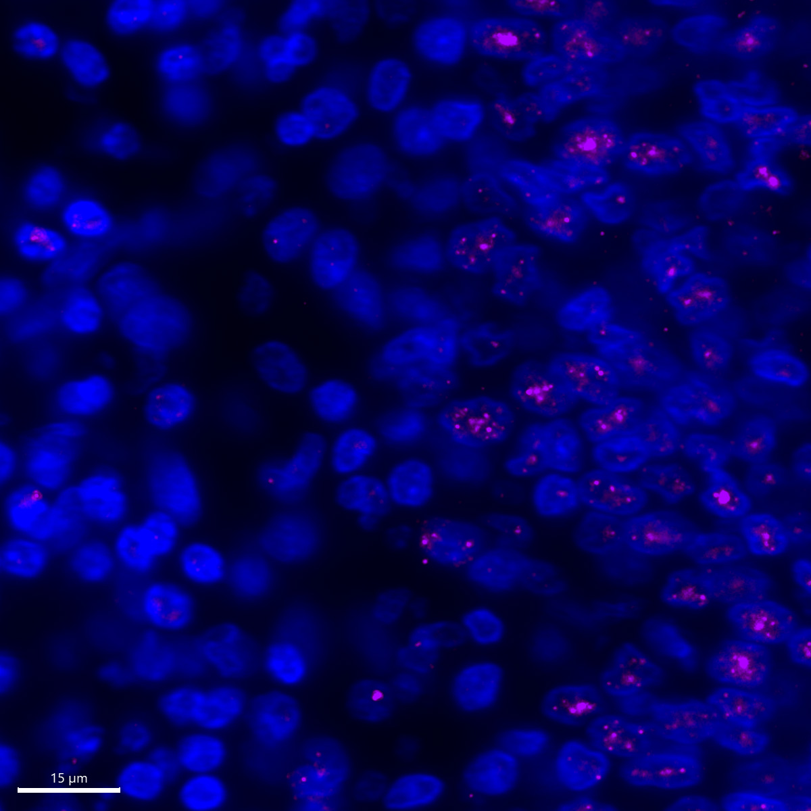

# Configurations

| UniProt Accession Number   | Reagent Type     | Target Name / Protein Biomarker   | Target Species   | Host Organism   | Isotype   |   Clonality | Vendor                    |   Catalog Number | Conjugate    | RRID      | Availability   | Method                 | Tissue Preservation   | Target Tissue   | Tissue State        | Detergent         | Antigen Retrieval Conditions                                                               | Dye Inactivation Conditions   | Recommend   | Agree                                                        | Disagree   | Contributor                                                  | Notes       |
|:---------------------------|:-----------------|:----------------------------------|:-----------------|:----------------|:----------|------------:|:--------------------------|-----------------:|:-------------|:----------|:---------------|:-----------------------|:----------------------|:----------------|:--------------------|:------------------|:-------------------------------------------------------------------------------------------|:------------------------------|:------------|:-------------------------------------------------------------|:-----------|:-------------------------------------------------------------|:------------|
| NA                         | Primary Antibody | Phospho-SMAD3                     | Human            | Rabbit          | IgG       | EP823Y      | Abcam                     |          ab52903 | Unconjugated | AB_882596 | Stock          | IBEX2D Manual          | FFPE                  | Lung            | IPF                 | 0.3% Triton-X-100 | 10 mM citrate buffer (pH 6.0) for 30 minutes at 95C                                        | NA                            | Yes         | [0000-0002-8728-1735](https://orcid.org/0000-0002-8728-1735) | NA         | [0000-0002-8728-1735](https://orcid.org/0000-0002-8728-1735) | [1](#notes) |

# Publications

# Additional Notes

1. This antibody labels the anticipated subcellular compartment (nucleus). This antibody was detected using a secondary antibody (Abcam, ab150079). We used a secondary only control to test for non-specific binding of the secondary antibody and observerd no signal as expected (not shown). The following antibody was tested for Phospho-SMAD3 and is not recommended: Cell Signaling Technology, 9520.

| Human IPF lung FFPE: Phospho-SMAD3 (magenta) and DAPI (blue) |
|:-------:|
|  |
