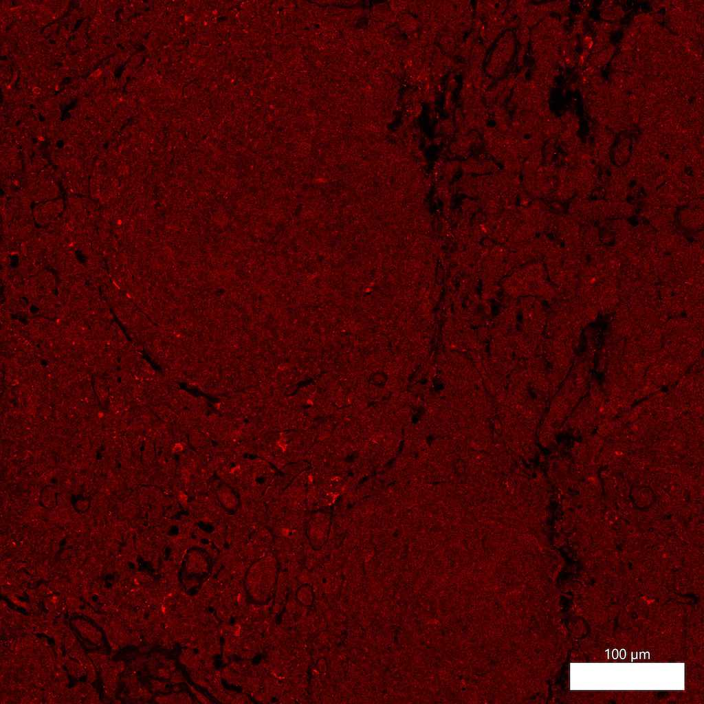

# Configurations

| UniProt Accession Number   | Reagent Type     | Target Name / Protein Biomarker   | Target Species   | Host Organism   | Isotype   | Clonality   | Vendor                    | Catalog Number   | Conjugate    | RRID   | Availability   | Method                 | Tissue Preservation   | Target Tissue   | Tissue State        | Detergent         | Antigen Retrieval Conditions                                                               | Dye Inactivation Conditions   | Recommend   | Agree                                                        | Disagree   | Contributor                                                  | Notes       |
|:---------------------------|:-----------------|:----------------------------------|:-----------------|:----------------|:----------|:------------|:--------------------------|:-----------------|:-------------|:-------|:---------------|:-----------------------|:----------------------|:----------------|:--------------------|:------------------|:-------------------------------------------------------------------------------------------|:------------------------------|:------------|:-------------------------------------------------------------|:-----------|:-------------------------------------------------------------|:------------|
| P19838                     | Primary Antibody | Phospho NF-Kappa B p105           | Human            | Rabbit          | IgG       | 178F3       | Cell Signaling Technology | PA5-79525        | Unconjugated | NA     | Stock          | Multiplexed 2D Imaging | FFPE                  | Lymph Node      | Follicular Lymphoma | 0.3% Triton-X-100 | pH 6 for 30 minutes ER1 (AR9961) and pH 9 for 30 minutes ER2 (AR9640) using the Leica Bond | NA                            | No          | [0000-0003-4379-8967](https://orcid.org/0000-0003-4379-8967) | NA         | [0000-0003-4379-8967](https://orcid.org/0000-0003-4379-8967) | [1](#notes) |

# Publications

# Additional Notes

1. Antibody labeling is inconclusive and appears to label all cells in a follicular lymphoma FFPE tissue section. Used at a dilution of 1:50 with an anti-rabbit AF594 secondary antibody (Thermo Fisher Scientific catalog number A-21207).

| Human follicular lymphoma FFPE : Phospho NF-Kappa B p105 (red, catalog number 4808) |
|:-------:|
|  |
