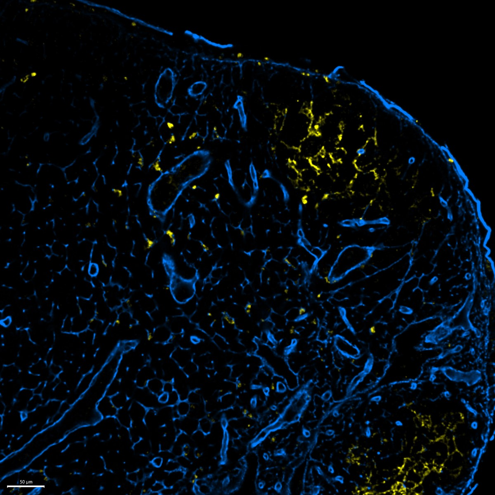

# Configurations

| UniProt Accession Number   | Reagent Type       | Target Name / Protein Biomarker   | Target Species   | Host Organism   | Isotype   | Clonality   | Vendor                   | Catalog Number   | Conjugate   | RRID       | Availability   | Method        | Tissue Preservation               | Target Tissue   | Tissue State   | Detergent         | Antigen Retrieval Conditions   | Dye Inactivation Conditions   | Recommend   | Agree                                                        | Disagree   | Contributor                                                  | Notes   |
|:---------------------------|:-------------------|:----------------------------------|:-----------------|:----------------|:----------|:------------|:-------------------------|:-----------------|:------------|:-----------|:---------------|:--------------|:----------------------------------|:----------------|:---------------|:------------------|:-------------------------------|:------------------------------|:------------|:-------------------------------------------------------------|:-----------|:-------------------------------------------------------------|:--------|
| NA                         | Secondary Antibody | Rabbit IgG (H+L)                  | Mouse            | Goat            | IgG       | Polyclonal  | Thermo Fisher Scientific | A-11009          | AF532       | AB_2534076 | Stock          | IBEX2D Manual | 1:4 Cytofix/Cytoperm Fixed Frozen | Lymph Node      | NA             | 0.3% Triton-X-100 | NA                             | 1 mg/ml LiBH4 15 minutes      | Yes         |  [0000-0003-1118-7432](https://orcid.org/0000-0003-1118-7432) | NA         | [0000-0003-1118-7432](https://orcid.org/0000-0003-1118-7432) |         |

# Publications

# Additional Notes

| Mouse lymph node: CD35 (yellow, catalog number 740132) and Collagen IV (blue, catalog number ab19808 and A-11009) |
|:-------:|
|  |
