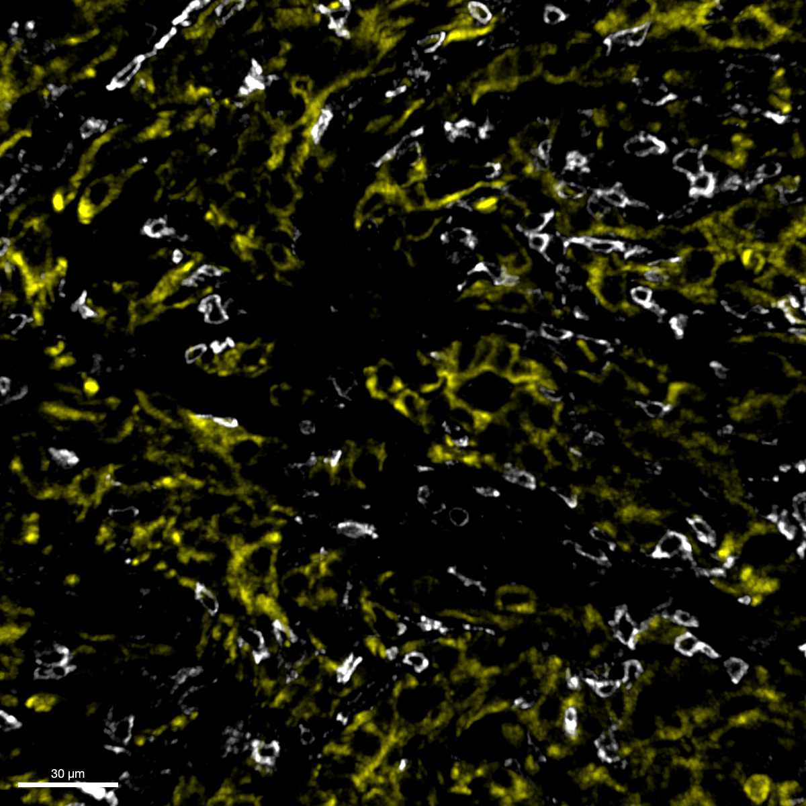

# Configurations

| UniProt Accession Number   | Reagent Type     | Target Name / Protein Biomarker   | Target Species   | Host Organism   | Isotype   | Clonality   | Vendor    |   Catalog Number | Conjugate   | RRID       | Availability   | Method        | Tissue Preservation               | Target Tissue                    | Tissue State   | Detergent         | Antigen Retrieval Conditions   | Dye Inactivation Conditions   | Recommend   | Agree                                                        | Disagree   | Contributor                                                  | Notes       |
|:---------------------------|:-----------------|:----------------------------------|:-----------------|:----------------|:----------|:------------|:----------|-----------------:|:------------|:-----------|:---------------|:--------------|:----------------------------------|:---------------------------------|:---------------|:------------------|:-------------------------------|:------------------------------|:------------|:-------------------------------------------------------------|:-----------|:-------------------------------------------------------------|:------------|
| P97797                     | Primary Antibody | SIRPalpha                         | Mouse            | Rat             | IgG1      | P84         | BioLegend |           144027 | AF647       | AB_2721300 | Stock          | IBEX2D Manual | 1:4 Cytofix/Cytoperm Fixed Frozen | Pancreatic Ductal Adenocarcinoma | Tumor          | 0.3% Triton-X-100 | NA                             | 1 mg/ml LiBH4 15 minutes      | Yes         | [0009-0007-0646-7946](https://orcid.org/0009-0007-0646-7946) | NA         | [0009-0007-0646-7946](https://orcid.org/0009-0007-0646-7946) | [1](#notes) |

# Publications

# Additional Notes

1. Very bright, recommend dilution 1:200.

| Mouse tumor: Cytokeratin (yellow, catalog number 628608) and SIRPalpha (white, catalog number 144027) |
|:-------:|
|  |
