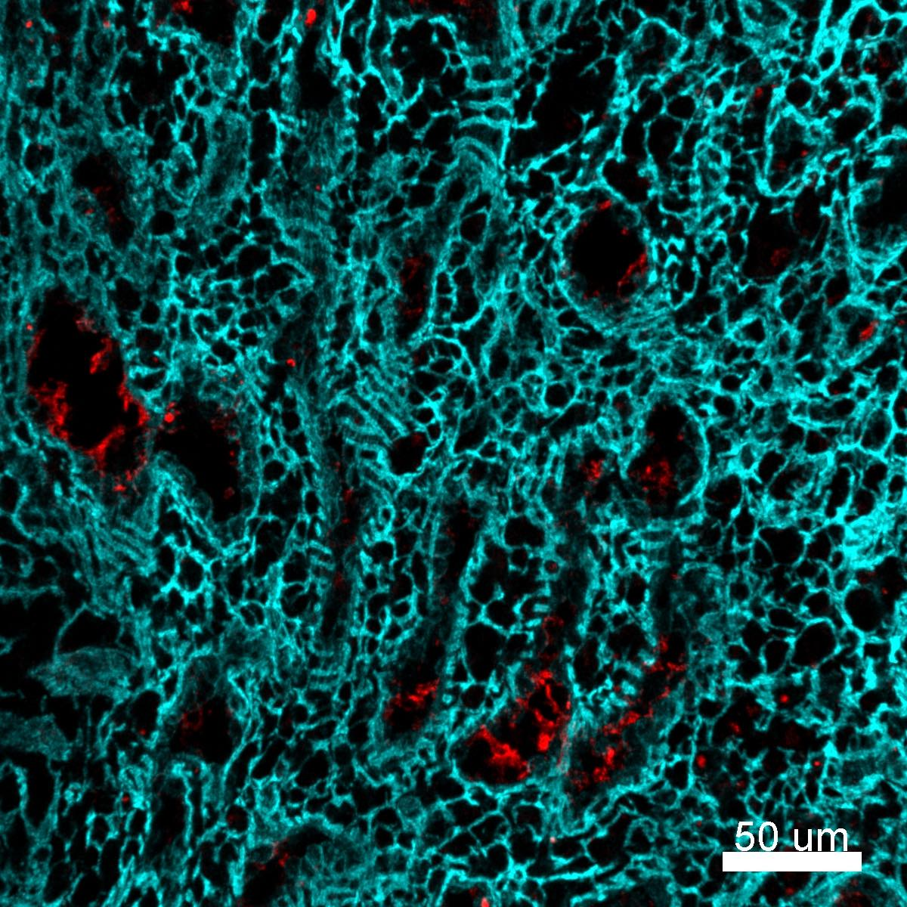

# Configurations

| UniProt Accession Number   | Reagent Type       | Target Name / Protein Biomarker   | Target Species   | Host Organism   | Isotype   | Clonality   | Vendor                   | Catalog Number   | Conjugate   | RRID       | Availability   | Method        | Tissue Preservation               | Target Tissue   | Tissue State   | Detergent         | Antigen Retrieval Conditions   | Dye Inactivation Conditions   | Recommend   | Agree                                                        | Disagree   | Contributor         | Notes       |
|:---------------------------|:-------------------|:----------------------------------|:-----------------|:----------------|:----------|:------------|:-------------------------|:-----------------|:------------|:-----------|:---------------|:--------------|:----------------------------------|:----------------|:---------------|:------------------|:-------------------------------|:------------------------------|:------------|:-------------------------------------------------------------|:-----------|:--------------------|:------------|
| NA                         | Secondary Antibody | Sheep IgG (H+L)                   | Human            | Donkey          | IgG       | Polyclonal  | Thermo Fisher Scientific | A-21102          | AF680       | AB_2535755 | Stock          | IBEX2D Manual | 1:4 Cytofix/Cytoperm Fixed Frozen | Liver           | NA             | 0.3% Triton-X-100 | NA                             | 1 mg/ml LiBH4 15 minutes      | Yes         | [0000-0003-4379-8967](https://orcid.org/0000-0003-4379-8967) [[2](#publications), [1](#publications)] | NA         | [0000-0003-4379-8967](https://orcid.org/0000-0003-4379-8967) |             |
| NA                         | Secondary Antibody | Sheep IgG (H+L)                   | Human            | Donkey          | IgG       | Polyclonal  | Thermo Fisher Scientific | A-21102          | AF680       | AB_2535755 | Stock          | IBEX2D Manual | 1:4 Cytofix/Cytoperm Fixed Frozen | Spleen          | NA             | 0.3% Triton-X-100 | NA                             | 1 mg/ml LiBH4 15 minutes      | Yes         | [0000-0003-4379-8967](https://orcid.org/0000-0003-4379-8967) [[2](#publications), [1](#publications)] | NA         | [0000-0003-4379-8967](https://orcid.org/0000-0003-4379-8967) |             |
| NA                         | Secondary Antibody | Sheep IgG (H+L)                   | Human            | Donkey          | IgG       | Polyclonal  | Thermo Fisher Scientific | A-21102          | AF680       | AB_2535755 | Stock          | IBEX2D Manual | 1:4 Cytofix/Cytoperm Fixed Frozen | Lymph Node      | NA             | 0.3% Triton-X-100 | NA                             | 1 mg/ml LiBH4 15 minutes      | Yes         | [0000-0003-4379-8967](https://orcid.org/0000-0003-4379-8967)                                          | NA         | [0000-0003-4379-8967](https://orcid.org/0000-0003-4379-8967) | [1](#notes) |

# Publications

1. A. J. Radtke et al., "IBEX: an iterative immunolabeling and chemical bleaching
 method for high-content imaging of diverse tissues", *Nat. Protoc.*, 17(2):378-401, 2022, [doi: 10.1038/s41596-021-00644-9](https://doi.org/10.1038/s41596-021-00644-9).

    A. J. Radtke et al., "Accompanying dataset for: IBEX: An iterative immunolabeling and chemical bleaching method for high-content imaging of diverse tissues", [doi: 10.5281/zenodo.5244550](https://doi.org/10.5281/zenodo.5244551).

2. A. J. Radtke et al., "IBEX: A versatile multiplex optical imaging approach for deep phenotyping and spatial analysis of cells in complex tissues", *Proc Natl Acad Sci*, 117(52):33455–33465, 2020, [doi:10.1073/pnas.2018488117](https://doi.org/10.1073/pnas.2018488117)

# Additional Notes

1. This antibody can be used to evaluate unconjugated sheep primary antibodies in a wide range of tissues. Be careful when using unconjugated primary antibodies as IBEX protocol does not strip antibodies. Place antibodies in first cycle and use direct conjugates in later cycles. Careful when combining with goat, rabbit, and other unconjugated primary antibodies as secondary antibodies may not be cross-adsorbed.

| Human spleen: CD49a (cyan, catalog number 328310) and Fibrinogen (red, catalog number ab118533 and A-21102) |
|:-------:|
|  |
