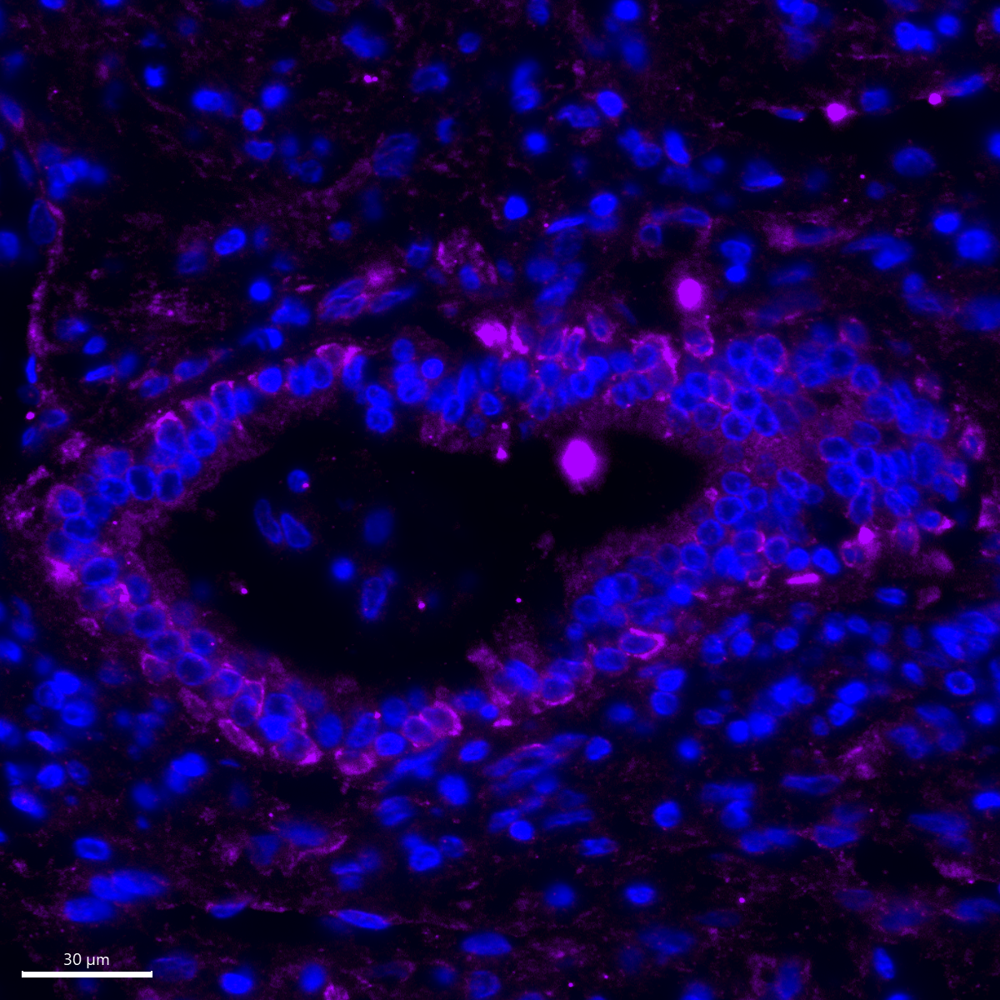

# Configurations

| UniProt Accession Number   | Reagent Type     | Target Name / Protein Biomarker   | Target Species   | Host Organism   | Isotype   |   Clonality | Vendor                    |   Catalog Number | Conjugate    | RRID       | Availability   | Method                 | Tissue Preservation   | Target Tissue   | Tissue State                  | Detergent         | Antigen Retrieval Conditions                                                               | Dye Inactivation Conditions   | Recommend   | Agree                                                        | Disagree   | Contributor                                                  | Notes       |
|:---------------------------|:-----------------|:----------------------------------|:-----------------|:----------------|:----------|------------:|:--------------------------|-----------------:|:-------------|:-----------|:---------------|:-----------------------|:----------------------|:----------------|:------------------------------|:------------------|:-------------------------------------------------------------------------------------------|:------------------------------|:------------|:-------------------------------------------------------------|:-----------|:-------------------------------------------------------------|:------------|
| P37173                     | Primary Antibody | TGFBR2                            | Human            | Mouse           | IgG1      | MM0056-4F14 | Abcam                     |          ab78419 | Unconjugated | AB_1603198 | Stock          | IBEX2D Manual          | FFPE                  | Lung            | Idiopathic Pulmonary Fibrosis | 0.3% Triton-X-100 | 10 mM citrate buffer (pH 6.0) for 30 minutes at 95C                                        | NA                            | Yes         | [0000-0002-8728-1735](https://orcid.org/0000-0002-8728-1735) | NA         | [0000-0002-8728-1735](https://orcid.org/0000-0002-8728-1735) | [1](#notes) |

# Publications

# Additional Notes

1. This antibody labels the anticipated subcellular compartment (membrane). This antibody was detected using a secondary antibody (Abcam, ab150107). We used a secondary only control to test for non-specific binding of the secondary antibody and observed no signal as expected (not shown).

| Human lung (Idiopathic Pulmonary Fibrosis) FFPE: TGFBR2 (magenta) and DAPI (blue) |
|:-------:|
|  |
