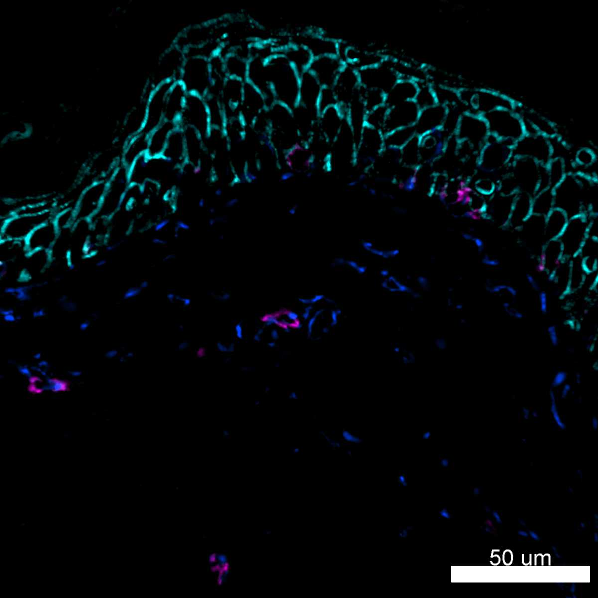

# Configurations

| UniProt Accession Number   | Reagent Type     | Target Name / Protein Biomarker   | Target Species   | Host Organism   | Isotype   | Clonality   | Vendor    |   Catalog Number | Conjugate   | RRID       | Availability   | Method           | Tissue Preservation               | Target Tissue   | Tissue State   | Detergent         | Antigen Retrieval Conditions   | Dye Inactivation Conditions             | Recommend   | Agree                                    | Disagree   | Contributor         | Notes       |
|:---------------------------|:-----------------|:----------------------------------|:-----------------|:----------------|:----------|:------------|:----------|-----------------:|:------------|:-----------|:---------------|:-----------------|:----------------------------------|:----------------|:---------------|:------------------|:-------------------------------|:----------------------------------------|:------------|:-----------------------------------------|:-----------|:--------------------|:------------|
| P08670                     | Primary Antibody | Vimentin                          | Human            | Mouse           | IgG2a     | O91D3       | BioLegend |           677804 | AF594       | AB_2566179 | Stock          | IBEX2D Automated | 1:4 Cytofix/Cytoperm Fixed Frozen | Lymph Node      | NA             | 0.3% Triton-X-100 | NA                             | 1 mg/ml LiBH4 for more than 120 minutes | Yes         | [0000-0003-4379-8967](https://orcid.org/0000-0003-4379-8967) [[1](#publications)] | NA         | [0000-0003-4379-8967](https://orcid.org/0000-0003-4379-8967) | [1](#notes) |
| P08670                     | Primary Antibody | Vimentin                          | Human            | Mouse           | IgG2a     | O91D3       | BioLegend |           677804 | AF594       | AB_2566179 | Stock          | IBEX2D Automated | 1:4 Cytofix/Cytoperm Fixed Frozen | Skin            | NA             | 0.3% Triton-X-100 | NA                             | 1 mg/ml LiBH4 for more than 120 minutes | Yes         | [0000-0003-4379-8967](https://orcid.org/0000-0003-4379-8967) [[1](#publications)] | NA         | [0000-0003-4379-8967](https://orcid.org/0000-0003-4379-8967) | [1](#notes) |

# Publications

1. A. J. Radtke et al., "IBEX: an iterative immunolabeling and chemical bleaching
 method for high-content imaging of diverse tissues", *Nat. Protoc.*, 17(2):378-401, 2022, [doi: 10.1038/s41596-021-00644-9](https://doi.org/10.1038/s41596-021-00644-9).

    A. J. Radtke et al., "Accompanying dataset for: IBEX: An iterative immunolabeling and chemical bleaching method for high-content imaging of diverse tissues", [doi: 10.5281/zenodo.5244550](https://doi.org/10.5281/zenodo.5244551).

# Additional Notes

1. Conjugate requires extended treatment with 1 mg/ml LiBH4 (120 minutes or more) to extinguish signal. Use in the last cycle or as a fiducial for IBEX experiments.

| Human lymph node: CD49a (green, catalog number 328310) and Vimentin (blue, catalog number 677804) |
|:-------:|
|  |

| Human skin: CD117 (magenta, catalog number 313203), CD138 (cyan, catalog number 356524), and Vimentin (blue, catalog number 677804) |
|:-------:|
|  |
