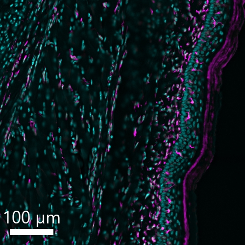

# Configurations

| UniProt Accession Number   | Reagent Type     | Target Name / Protein Biomarker   | Target Species   | Host Organism   | Isotype   | Clonality   | Vendor    |   Catalog Number | Conjugate   | RRID       | Availability   | Method                 | Tissue Preservation   | Target Tissue   | Tissue State   | Detergent              | Antigen Retrieval Conditions   | Dye Inactivation Conditions   | Recommend   | Agree                                                        | Disagree   | Contributor                                                  | Notes       |
|:---------------------------|:-----------------|:----------------------------------|:-----------------|:----------------|:----------|:------------|:----------|-----------------:|:------------|:-----------|:---------------|:-----------------------|:----------------------|:----------------|:---------------|:-----------------------|:-------------------------------|:------------------------------|:------------|:-------------------------------------------------------------|:-----------|:-------------------------------------------------------------|:------------|
| P20152                     | Primary Antibody | Vimentin                          | Mouse            | Rat             | IgG2a     | W16220A     | BioLegend |           699308 | AF647       | AB_2888890 | Stock          | Multiplexed 2D Imaging | 4% PFA Fixed Frozen   | Whole Foot      | NA             | Akoya Antibody Diluent | NA                             | 1 mg/ml LiBH4 15 minutes      | Yes         | [0009-0006-7582-6095](https://orcid.org/0009-0006-7582-6095) | NA         | [0009-0006-7582-6095](https://orcid.org/0009-0006-7582-6095) | [1](#notes) |

# Publications

# Additional Notes

1. Decalcified 48h on rotation in 15ml Immunocal with 24h media change.

| Mouse whole foot Fixed Frozen: Vimentin (magenta, catalog number 699308) and DAPI (cyan, MBD0015) |
|:-------:|
|  |