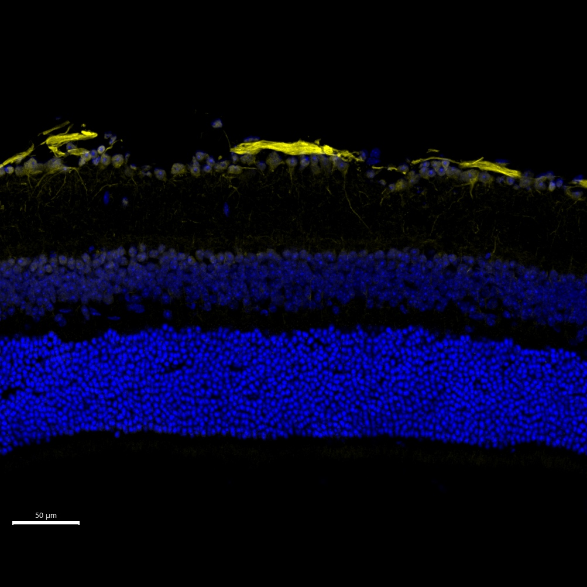

# Configurations

| UniProt Accession Number   | Reagent Type     | Target Name / Protein Biomarker   | Target Species   | Host Organism   | Isotype   | Clonality   | Vendor                   | Catalog Number   | Conjugate   | RRID      | Availability   | Method        | Tissue Preservation               | Target Tissue   | Tissue State   | Detergent   | Antigen Retrieval Conditions   | Dye Inactivation Conditions                                  | Recommend   | Agree                                                        | Disagree   | Contributor                                                  | Notes   |
|:---------------------------|:-----------------|:----------------------------------|:-----------------|:----------------|:----------|:------------|:-------------------------|:-----------------|:------------|:----------|:---------------|:--------------|:----------------------------------|:----------------|:---------------|:------------|:-------------------------------|:-------------------------------------------------------------|:------------|:-------------------------------------------------------------|:-----------|:-------------------------------------------------------------|:--------|
| P51480                     | Primary Antibody | p16                               | Mouse            | Mouse           | IgG2a     | F-12        | Santa Cruz Biotechnology | SC-1661-AF546    | AF546       | AB_628067 | Stock          | IBEX2D Manual | 1:4 Cytofix/Cytoperm Fixed Frozen | Retina          | Healthy        | 0.1% Tween  | NA                             | Does not bleach within 15 minutes of 1 mg/ml LiBH4 treatment | Yes         | [0009-0003-0776-2163](https://orcid.org/0009-0003-0776-2163) | NA         | [0009-0003-0776-2163](https://orcid.org/0009-0003-0776-2163) |         |

# Publications

# Additional Notes

| Mouse retina: p16 (yellow, catalogue number SC-1661-AF546) and DAPI (blue, catalogue number D9542-1MG) |
|:-------:|
|  |